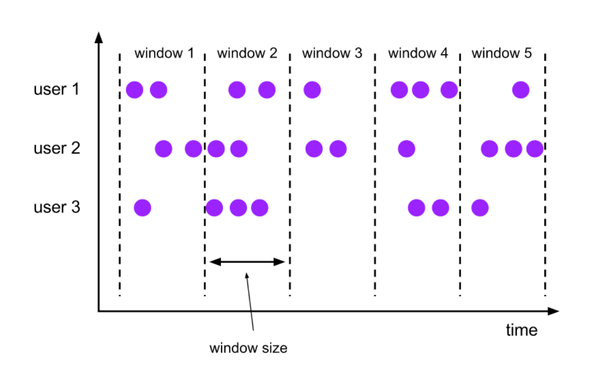

## 前言
今天分享的主题是 Flink SQL 带你玩转实时数据。最近团队用 Flink SQL 完成了实时银指标生产，未来会有越来越多的实时指标需要上线，到时候需要各位同学帮忙。所以今天打算通过本场分享，让各位同学掌握 Flink SQL 的基础玩法，能够使用 Flink SQL 生产实时指标。

我先进行自我介绍，我是 Danny，New Team 的大数据架构工程师，Footprint 的大数据架构实施者。经常和团队冲锋在技术第一线，不是在坑里就是在走向坑的路上。最近刚从 Flink 这个深坑里出来，一路波折，取得真经，下面由我来传经。
首先请各位同学思考以下问题：

- 什么是流？什么是批？
- 如何对流数据进行计算？
- 如何知道流数据算到哪了？
- 计算过程中程序崩溃了咋搞？
- 如何生产实时币价到 Iceberg？
## 认识流
各位请先看一段 Trino SQL，请猜这段 SQL 在 Flink 上面执行会出现什么问题？（Flink 上 的token_price 是源源不断的流数据）
```sql
select token_address, avg(price)
from token_price
where token_timestamp >= date_add('minute', -5, current_timestamp)
group by token_address
```
答案是内存会爆炸，为什么呢？
得从流的概念讲起，我们来分析下流和批有什么不同的地方

|  | 批 | 流 |
| --- | --- | --- |
| 数据量 | 有限 | 无限 |
| 数据边界 | 存在边界 | 不存边界 |

前面的 SQL，一直在接收最新的币价，所以 where 条件始终为 true。只要币价不中断，这段 SQL 就会一直执行（无界数据的体现）且 group by 需要在内存中记录分组信息，但流数据又是无限的，这就会把内存给撑爆，程序崩溃。程序崩溃后该怎么恢复，从头算起吗？
总结一下，流计算的难点：

- 处理无限的数据
- 无线膨胀的内存
- 程序崩溃后如何恢复
## 如何计算流数据
### 时间窗口
流计算的难点主要是由无限的数据和数据没有边界带来的，那有没有一个东西能将流数据变成 "有限" 和 "有边界" 的数据呢？
那肯定是有的，Flink 带来了一个叫时间窗口的东西，他能够赋予流数据边界。
那时间窗口是怎么做到的呢？Flink 将数据分派到符合的窗口上，时间窗口有开始时间和结束时间。例如现在有一个时间窗口是 12:00 ~ 12:05 时间段的，那么这个窗口只接收 12:00 ~ 12:05 期间内的数据。当这个时间窗口过期后，窗口内的数据会被释放掉，也就是释放掉了一些内存空间。这样一来，使用的内存得以被控制，不至于无限膨胀。

### 状态
前文 SQL 中的 group by 操作会将很多分组信息放在内存中，这些中间计算结果就是 Flink 中的状态。Flink SQL 可以定期地将状态 State 存储到磁盘中，存储到磁盘中的状态叫 CheckPoint。当 Flink 程序崩溃后，只需找到磁盘中最新的 Checkpoint 即可恢复状态，这样子就可以不用从头算起。
btw，像 Flink SQL 写 Iceberg 的程序，一定要开启 Checkpoint，不然在 Iceberg 上是查不到写入数据的。是因为 Flink 在提交 Checkpoint 时也向 Iceberg 提交新的 Snapshot。

好的，了解完窗口和状态这俩个概念后，那我们如何在 Flink 里面应用呢？前文的 SQL 应该在 Flink 里面呈现呢？下面来到实战环节。
## 实战
```sql
-- 连接 iceberg
CREATE CATALOG iceberg WITH (
  'type'='iceberg',
  'catalog-type'='hive',
  'uri'='thrift://metastore_ip:9083',
  'clients'='5',
  'property-version'='2',
  'warehouse'='gs://footbase-prod/hive-warehouse'
);

-- 读取 Kafka 上的币价
CREATE TABLE token_price_stream (
   token_address varchar,
   chain varchar,
   token_symbol varchar,
   `timestamp` bigint,
   token_timestamp as to_timestamp(from_unixtime(`timestamp`, 'yyyy-MM-dd HH:mm:ss')),
   price double,
   WATERMARK FOR token_timestamp AS token_timestamp - INTERVAL '5' SECOND
)
WITH (
   'connector' = 'kafka',
    'topic' = 'token_price',
    'properties.bootstrap.servers' = 'kafka_ip:9092',
    'properties.group.id' = 'token_price_demo',
    'scan.startup.mode' = 'latest-offset',
    'format' = 'json',
    'json.fail-on-missing-field' = 'false',
    'json.ignore-parse-errors' = 'true'
);

-- 创建 Iceberg 币价表
CREATE TABLE if not exists iceberg.beta_silver.token_price_demo (
    token_address varchar,
    chain varchar,
    price double,
    PRIMARY KEY (chain, token_address) NOT ENFORCED
) with (
    'format-version'='2',
    'write.format.default' = 'ORC',
    'write.upsert.enabled'='true'
);

-- 开启并设置 Checkpoint
SET 'execution.checkpointing.interval' = '1min';
SET 'state.checkpoints.dir' = 'file:///opt/flink_cp';
-- 设置 job name
SET 'pipeline.name' = 'token_price_demo';

-- 设置了一个 10s 的滚动窗口
insert into iceberg.beta_silver.token_price_demo /*+ OPTIONS('upsert-enabled'='true') */(
select
    token_address, chain, avg(price) as price
from token_price_stream
group by token_address, chain, tumble(token_timestamp, interval '10' second)
)
```
## 总结
回顾本次分享，我们学习了流的概念，知道了流是无限数据和无界数据流；知道了时间窗口的概念，时间窗口可以将流数据变得有界；知道了什么是状态以及Flink如何快速从崩溃中恢复。最终我们通过一场实战训练，加深了我们对流数据、窗口、状态的理解。熟悉掌握以上这些，就算是入门Flink SQL啦。感谢各位的时间，本次分享结束。
