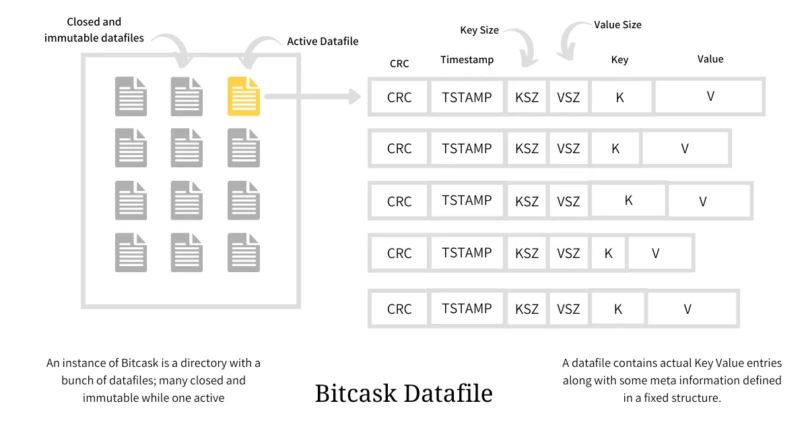

## Bitcask 介绍
Bitcask 是一种高性能的键值存储引擎，基于日志结构和哈希索引来提供高速的读写操作和数据持久性，适用于处理大量写入请求和快速查找键值对的应用场景。
## 核心概念
Bitcask 的设计与 LSM 相似，Bitcask 是将数据追加到日志文件内，然后在内存中构建 Key索引，将查询信息映射到日志条目所在数据文件的偏移量，从而加速查询。

### 更新与删除操作
Bitcask 的写入删除和更新都是已创建新 KV 的方式，这意味着 更新和删除操作 并不会直接删除旧的数据文件，而是通过修改内存的索引信息，达到的软删除的结果。
因为删除和更新都不会修改旧数据文件，所以 Bitcask 需要在对数据进行 compaction 时，将这些无效数据给移出，构建新的数据文件，同时还得更新内存中的索引信息，重新提交新的元信息。这个过程得保证原子性。
### 快速恢复
Bitcask 还考虑如何在程序崩溃后快速恢复。如果不做优化，程序 crash 后需要重新扫描所有的数据文件来构建索引信息。Bitcask 通过给每一个数据文件额外创建一个 hint 文件，这个文件内主要是有数据的元信息，程序读取 hint 文件即可完成内存索引的构造，加速了启动过程。
### 缺点
Bitcask 的缺点也是显而易见，需要在内存中构建所有文件的索引，这需要足够大的内存空间来完成。我们可以通过对数据进行分片进行分布式存储来解决这一问题。
## 参考资料
具体可参考以下文章：
- [https://medium.com/@arpitbhayani/bitcask-a-log-structured-fast-kv-store-c6c728a9536b](https://medium.com/@arpitbhayani/bitcask-a-log-structured-fast-kv-store-c6c728a9536b)
- [https://riak.com/assets/bitcask-intro.pdf](https://riak.com/assets/bitcask-intro.pdf)
