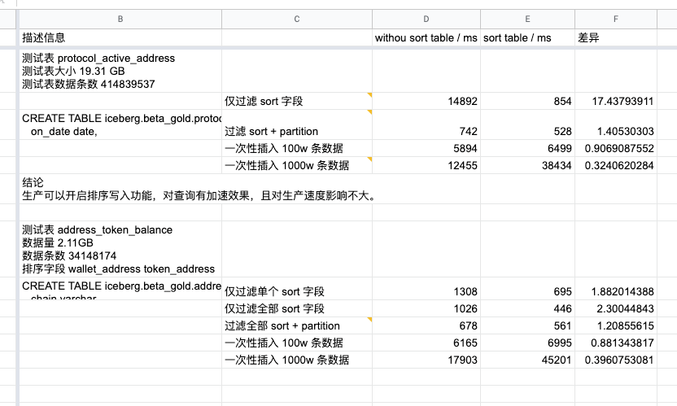

## 测试结论<br />

## 详细报告
测试表大小 19.31 GB<br />测试表数据条数 414839537<br />排序字段 wallet_address
```sql
CREATE TABLE iceberg.beta_gold.protocol_active_address_sorted (
   on_date date,
   chain varchar,
   protocol_slug varchar,
   wallet_address varchar,
   protocol_name varchar,
   is_new_address boolean,
   protocol_type varchar
)
WITH (
   format = 'ORC',
   format_version = 2,
   partitioning = ARRAY['month(on_date)'],
   sorted_by = ARRAY['wallet_address']
)
```

### 仅过滤 sort 字段

- sort table: 854ms
- without sort table: 14892 ms
- 查询速度差 17 倍
```sql
select * from iceberg.beta_gold."protocol_active_address_sorted" 
where wallet_address = '0x24f7c21da174ec903019095746f8955485bd952d'
```

### 过滤 sort + partition 

- sort table: 528 ms
- without sort table: 742 ms
- 查询速度差 1.4 倍
```sql
select * from iceberg.beta_gold."protocol_active_address_sorted" 
where on_date > date '2023-01-01'
and wallet_address = '0x0000000009572a244a6c2d06ffe7be30e3bd2aec'
```

### 插入性能
#### 一次性插入 100w 条苏局

- sort table: 5894 ms
- without sort table: 6499 ms
- 插入性能差 1.1 倍
```sql
insert into iceberg.beta_gold."protocol_active_address_sorted" 
select * from iceberg.prod_gold.protocol_active_address
limit 1000000
```

#### 一次性插入 1000w 条数据

- sort table: 38434 ms
- without sort table: 12455 ms
- 插入性能差 3 倍
```sql
insert into iceberg.beta_gold."protocol_active_address_sorted" 
select * from iceberg.prod_gold.protocol_active_address
limit 10000000
```
## 
