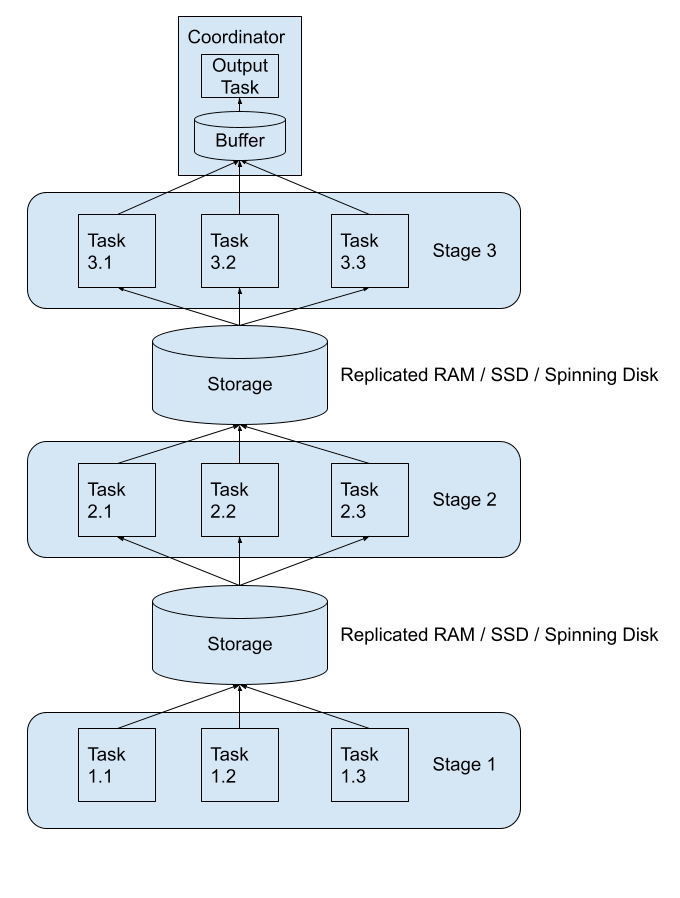

最近在调研 trino 能不能实现像 spark 一样有计算和处理海量数据的能力，如果能够实现我们便可以抛弃 spark，彻底拥抱 trino。经调研发现 trino 最近推出的一个项目，名为 tardigrade，中文叫缓步动物，这种动物及其顽强，trino 推出的功能也如其名，让所有查询都变得顽强，不容易挂掉。于是，trino 便拥有ETL海量数据的能力。
## 什么是 Tardigrade 项目
大家喜欢使用 Trino 的地方在于它的查询速度很快，可以通过直观的错误消息、交互体验和联邦查询来解决业务问题。长期存在的一个大问题是，为长时间运行的 ETL 工作负载配置、调优和管理 Trino 是非常困难的。以下是你必须处理的一些问题：

- 可靠的完成时间：运行数小时的查询可能会失败，从头开始重新启动它们会浪费资源，并使我们难以满足完成时间的要求。
- 具有成本效益的集群：我们需要 TB 级分布式内存的 Trino 集群来执行查询；
- 并发性：多个独立客户端可以并发提交查询。由于在某一时刻缺乏可用资源，其中一些查询可能需要终止并在一段时间后重新开始，这使得作业完成时间更加难以预测。

为了解决上面问题我们可能需要由专家团队来完成，但这对大多数用户来说是不可能的。Tardigrade 项目的目标是为上述问题提供一个 “开箱即用” 的解决方案。社区设计了一种新的容错执行架构（fault-tolerant execution architecture），它允许我们实现具有细粒度重试的高级资源感知调度（advanced resource-aware scheduling）。以下是 Tardigrade 项目带来的效果：

- 当长时间运行的查询遇到故障时，我们不必从头开始再运行它们。
- 当查询需要的内存超过集群中当前可用的内存时，它们仍然能够运行成功；
- 当多个查询同时提交时，它们能够以公平的方式共享资源，并稳步运行。

Trino 在幕后完成所有分配、配置和维护查询处理的繁重工作。我们可以将时间花在分析和交付业务价值上，而不是花时间调优 Trino 集群以满足我们的工作负载需求，或者重新组织工作负载以满足我们 Trino 集群能力。
## Tardigrade 项目原理简介
Trino 的 Tardigrade 看起来是直接在 Trino 上实现了容错、查询 / 任务重试、shuffle 等核心功能。Trino 将上游 stage 的 shuffle 数据进行落盘，这个支持把数据写到 AWS A3、Google Cloud Storage、Azure Blob Storage 以及本地文件存储（这个是用于测试的），下游的 stage 从磁盘里面读取需要的数据。


因为 stage 和 stage 之间交互的数据都落盘了，所以如果某个 task 挂了，我们直接再重启一个即可，这样就可以实现 Task 级别的重试。在实现将 Task 的数据落盘过程中，目前单个 Task 会生成 N 个文件（N 代表下游 Stage 中的 Task 数）。熟悉 Spark 的同学肯定知道，这个问题在早期的 Spark 其实一样存在；不过 Trino 当前应该是早期开发阶段，用于快速实现容错机制，等整个框架都稳定运行了，在后期肯定是会对这个进行优化的。

## 配置

1. 首先你得需要准备一块云存储空间，S3、GCS 都支持，用于 trino 将每个查询阶段的中间数据持久化到磁盘中。因为磁盘里存储的是临时数据，所以可以给存储桶配置自动删除一天前的数据。
2. 配置交换管理器。在协调器和所有工作人员上的 Trino 安装的 etc 文件夹中添加文件 exchange-manager.properties，内容如下：
```yaml
exchange-manager.name=filesystem
exchange.base-directories=s3://<bucket-name>
exchange.s3.region=us-east-1
exchange.s3.aws-access-key=<access-key>
exchange.s3.aws-secret-key=<secret-key>
```

3. 启用任务级别重试。您需要通过将以下属性添加到 config.properties 来配置和启用任务级别重试。
```latex
retry-policy=TASK
query.hash-partition-count=50
```

4. 优化配置
   1. 启动压缩以减少在 GCS 上假脱机的数据量(exchange.compression-enabled=true) 
   2. 减少低内存杀手延迟以允许资源管理器更快地解除阻塞内存不足的节点 (query.low-memory-killer.delay=0s)
   3. 启用自动写入器缩放以优化 Trino 创建的表的输出文件大小 (scale-writers=true) 
## 效果
环境配置
Trino Version 400
8c 32g master * 1
8c 32g worker * 3

当时的进行的压测，并发 20 条峰值内存大概为 40-50g 的查询，循环跑一天，测试集群稳定性和查询稳定性。
测试结果：查询全都正常完成，平均完成每条查询耗时 25min，符合我们的预期，安排上线使用。上线使用至今，每天集群的 ETL 计算都稳定在运行，至今没发现太大问题。
## 总结
经过以上配置，Trino 拥有了 ETL 海量数据的能力，相对比 spark，Trino 开发成本和云服务成本都大幅降低。上线 trino 后，云服务费用这边下降了 40%，性能却没有衰减。Trino 带给我们太多惊喜了，感恩
## 参考
[https://www.iteblog.com/archives/10182.html](https://www.iteblog.com/archives/10182.html)
