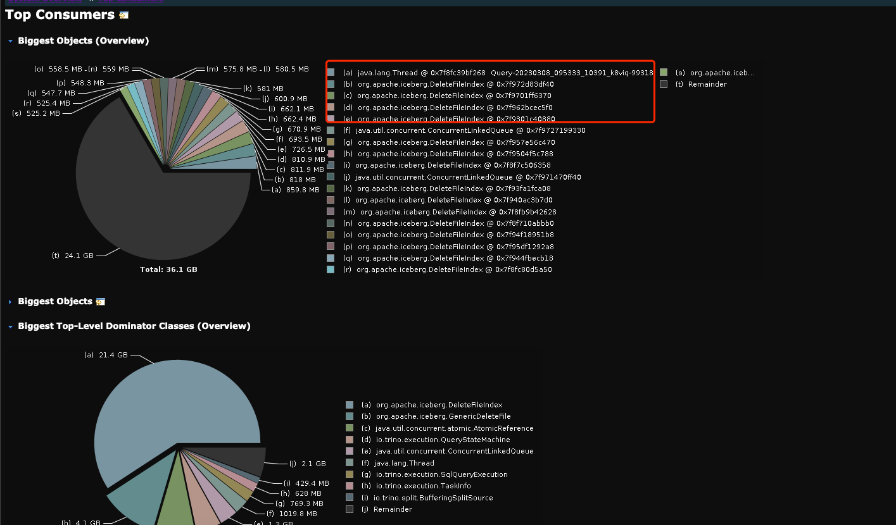
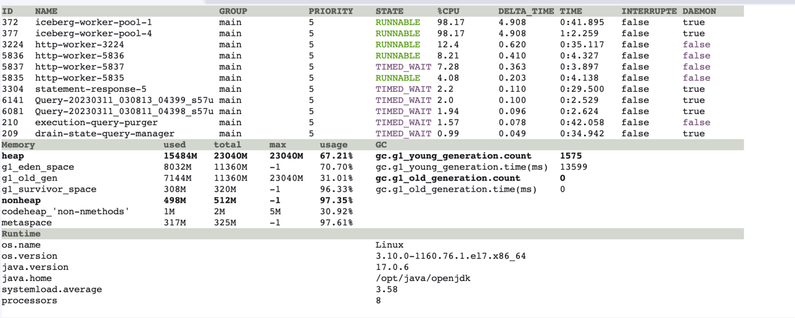
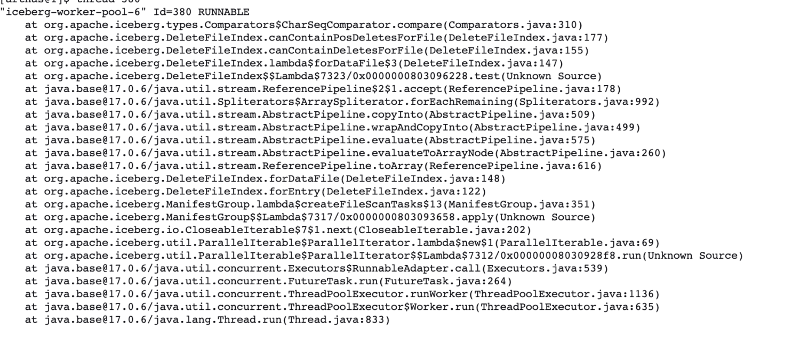
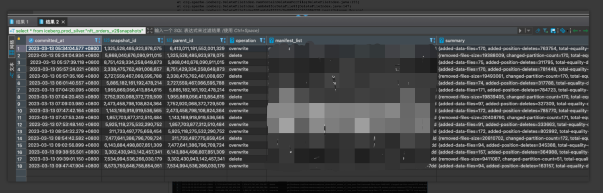
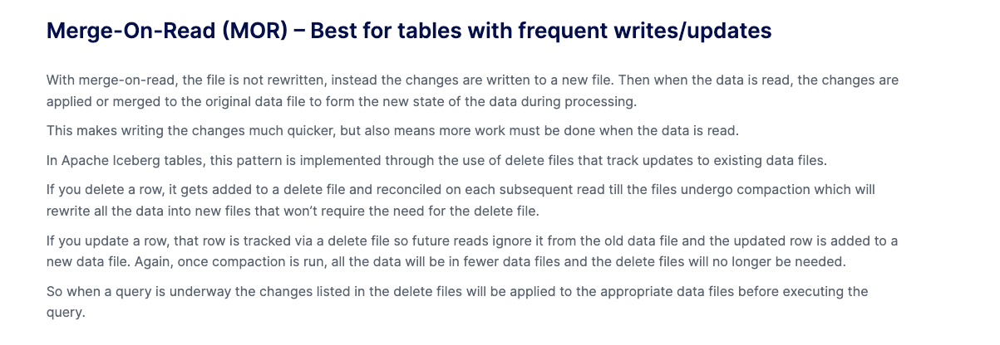

## 背景
最近线上的 trino 集群 master 节点老是因为 OOM crash，我们注意到 trino crash 前集群正在运行的查询数量正常，不太像是因为并发查询数据太多导致的 OOM。遂配置 trino master 的 jvm，使其在崩溃后生成一份 dump 文件，方便我们进行问题
## 排查问题过程
收集到了 Trino master oom dump 文件，用 mat 工具对其分析得出报告。
从报告得知，trino master crash 前有一条查询消耗掉了大量资源，还有一大堆的 DeleteFileIndex 实例也消耗掉很多资源。

我们有收集 trino 上所有的查询语句，通过 query_id 定位到那条异常 SQL。初看 SQL 逻辑，没太大问题，应该不会导致 trino master oom。
于是找一个 trino 集群做故障还原，发现并发执行 异常SQL 4条，master 就会 crash。
于是进 trino-master 容器内，用 arthas 实时观察 jvm 状况。
发现当 异常SQL 发起查询时，jvm 内 iceberg-work-pool 线程的 cpu 暂用率会飙升到 100%，且此时 jvm 内存也在飙升，过程持续 20s，刚好是异常SQL 生成执行计划所花费的时间。

然后使用 arthas 查看 iceberg-work-pool 线程在干嘛？发现其在调用 DeleteFileIndex 这个类，在报告里面也是属于 top 10 comsumer 。

看栈信息，得到信息在扫描 iceberg 的 manifestlist 时，会去扫描已删除的文件。猜测大概率是需要找到已删除的数据 和 现在存在的数据 做一个 merge，才是当前快照的真实数据。

于是分析 怀疑表 nft_orders_v2 的元数据信息，发现 snapshow 里需要读取大量的删除文件。
> snapshots
> 

而 Trino 是使用 merge on read 模式进行 merge/update/delete 操作的，这样的话每次查询时，得扫描 "delete file" 来和 "data file" 进行合并，得出真实数据。

所以问题就出现在这，由于该表每半小时生产一次，底层存在大量的 'delete file' ，每次查询时都要扫描这些  'delete file' 然后做 merge 操作生成执行计划。这步操作消耗掉很多 cpu资源和内存资源，导致 trino master 节点崩溃。

## 解决方案
使用 trino 的小文件合并功能，重写底层数据文件即可修复。
> ALTER TABLE nft_orders_v2 EXECUTE optimize (file_size_threshold => '100MB')

为了规避此类问题再次分析，还需要找出哪些查询的查询计划时间大于 10s，找出这些查询并分析用到的表的元数据是否合理，不合理要及时修正。

我们通过 dbt-trino 方式，实现找到 iceberg 下元数据不合理的表。
```sql
{{ config(
    materialized = 'table',
    on_table_exists = 'drop'
)}}



    SET SESSION query_max_stage_count = 500;
    select *
    from iceberg.information_schema.tables
    where table_catalog = 'iceberg'
    and table_schema in ('prod_bronze', 'prod_silver', 'prod_gold')
    and table_type != 'VIEW'
    and regexp_extract(table_name, 'test|tmp|duplicate') is null
    and table_name != 'partition_scan'


    
    
        
        
    



    select
        '{{table_name}}' as table_name,
        json_value(json_format(cast(summary as json)), 'lax $."total-delete-files"') as "total-delete-files",
        json_value(json_format(cast(summary as json)), 'lax $."total-position-deletes"') as "total-position-deletes",
        json_value(json_format(cast(summary as json)), 'lax $."total-equality-deletes"') as "total-equality-deletes",
        cast(committed_at as timestamp(6)) as committed_at
    from {{table_name}}
     union all 

```

通过此 dbt，我们可以发现哪些表的 Delete File 数量过多，需要及时修复。