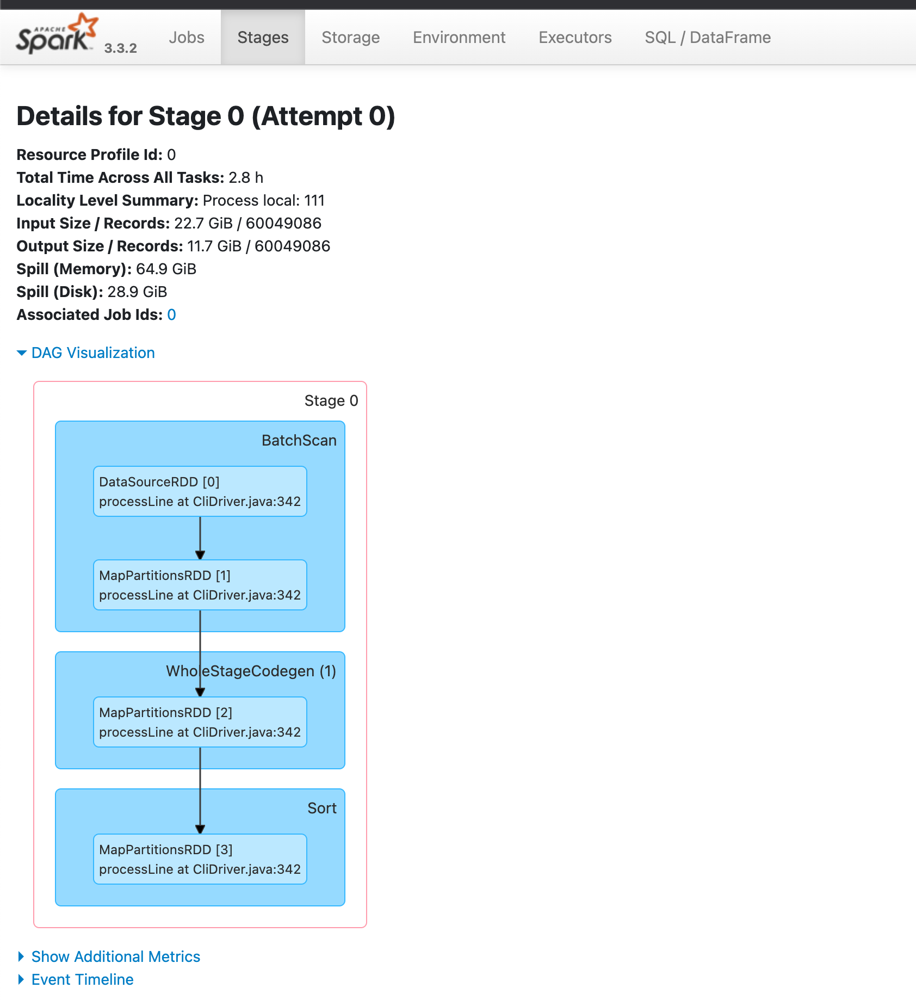
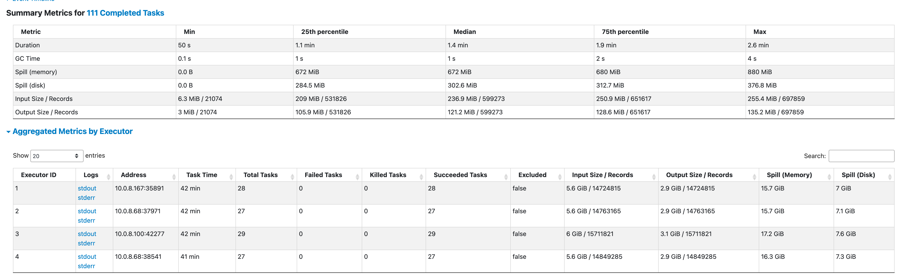

## 背景

为了降本增效，我们要将谷歌云上面的数据和服务迁移至腾讯云，其中包括 30TB 左右的 Iceberg 数据。Iceberg 数据要从 GCS 迁移到腾讯云的 EMR HDFS 上。本文是此次记录迁移过程及分享期间遇到的问题及解决方案。

## 迁移工具

我们使用腾讯云 EMR 的 Spark 集群完成了数据迁移。

- Spark 3.3_2.12
- Iceberg 1.1.0

## Spark 配置

Spark 需要配置读取 GCS 文件和读 Iceberg 表：

- GCS 配置参考： [https://github.com/GoogleCloudDataproc/hadoop-connectors/blob/master/gcs/INSTALL.md](https://github.com/GoogleCloudDataproc/hadoop-connectors/blob/master/gcs/INSTALL.md) 。这里需注意，GCP 的凭证文件要添置在各个 Spark 节点下，保证所有的 Spark 节点可以读取。
- Iceberg 配置：添加 `iceberg-spark-runtime-3.3_2.12-1.1.0.jar`到 spark/jars 下。可以在同 emr 中开启 Iceberg 组件，然后执行 `cp /usr/local/service/iceberg/iceberg-spark-runtime-3.3_2.12-1.1.0.jar /usr/local/service/spark/jars/`

然后需要配置 spark 连接俩 metastore，为了方便可以修改 spark-default.yaml 配置文件，这样子每次 spark 启动时即应用此份配置。

```python
spark.hadoop.fs.AbstractFileSystem.gs.impl  com.google.cloud.hadoop.fs.gcs.GoogleHadoopFS
spark.hadoop.google.cloud.auth.service.account.enable  true
spark.hadoop.google.cloud.auth.service.account.json.keyfile  /usr/local/service/hadoop/etc/hadoop/google_key.json

spark.sql.catalog.hive_prod  org.apache.iceberg.spark.SparkCatalog
spark.jars.packages  org.apache.iceberg:iceberg-spark-runtime-3.2_2.12:1.1.0
spark.sql.extensions  org.apache.iceberg.spark.extensions.IcebergSparkSessionExtensions
spark.sql.catalog.spark_catalog  org.apache.iceberg.spark.SparkSessionCatalog
spark.sql.catalog.spark_catalog.type  hive

spark.sql.catalog.tx_iceberg  org.apache.iceberg.spark.SparkCatalog
spark.sql.catalog.tx_iceberg.type  hive
spark.sql.catalog.tx_iceberg.uri  thrift://ip:port
spark.sql.catalog.gcp_iceberg  org.apache.iceberg.spark.SparkCatalog
spark.sql.catalog.gcp_iceberg.type  hive
spark.sql.catalog.gcp_iceberg.uri  thrift://ip:port
```

验证配置是否生效，可以在 spark 节点上执行 spark-sql，打开 spark sql 的客户端，简单执行查询下俩边的 iceberg 表和进行插入操作，判断是否读写都有权限。

## 迁移问题及解决方案

我们迁移的 Iceberg 表大部分都是按月分区或按日分区，然后有配置 sort order 键排序写入的。

同步的 SQL 语句也非常简单。

```python
insert into tx_iceberg.prod_bronze.sui_transaction_blocks
select * from gcp_iceberg.prod_bronze.sui_transaction_blocks
```

### Spark 资源不足

在刚开始同步时，发现同步速度缓慢。同步一张 10GB 表需要耗时20分钟，太慢了。于是便分析同步的 Spark Job，同步任务的 Spark Stage : 

- 加载数据源
- 将数据分区
- 将数据排序写入



因为需要对数据进行分区处理和排序处理，是很吃内存的，我们通过查看 Executor 指标也验证了这点，太多数据 Spill Disk ，这便是导致同步数据慢的原因。我们需要更大的内存来进行同步。



于是我们对 Spark 集群进行了扩容处理，考虑到我们的大表都是 700GB 往上，最大的 3TB，于是便将集群资源扩容到 10台*32c*128g 。

在创建同步任务之前，我们需要指定 Spark Application 使用的资源：

`spark-sql --master yarn --num-executors 10 --executor-cores 30 --executor-memory 120g`

### 减少 Shuffle 和 Sort

在集群对扩容后，同步速度有了大幅提升；但在同步一张 700GB 的表时，同步速度又慢了下来，慢的主要原因是 Shuffle 太多了，在任务中需要将 1400GB 的数据量（iceberg 数据解压后的数据）进行分区排序，然后 shuffle 到不同 executor 执行 sort order 写入。

我们做了俩项优化来解决了以上的问题：

- 改变同步模式: 将全量同步改为按分区同步。Spark 默认是将整张表的数据 load 到集群内，并不是 pipeline 方式插入数据的。为了减少任务的压力，我们每次仅传入一个分区的数据，这样子集群压力能减轻且速度更快。
- 设置 spark-iceberg 配置 `write.distribution-mode=hash`减少分区排序。在 Iceberg 1.2.0 之前默认是 `write.distribution-mode=none`，1.2.0 之后是 `write.distribution-mode=hash`。
    - `none`：spark 需要根据分区值对数据进行排序。数据必须在每个 Spark 任务内或在整个数据集中全局排序。
    - `hash`：spark 会对每行数据的分区值进行哈希处理，根据哈希结果分配到不同的 executor 中。

### Iceberg 小文件太多
我们在同步一张 4G 的表时，发现同步速度很慢，同步一张 4G 的表需要耗时30分钟。打开 Spark Job 分析任务的 Stage，发现读取 Iceberg 数据源的 Task 有 2000 个。每个 Task 做的事情都是从读取 GCP iceberg 的一个数据文件 load 回 Spark 中。
然后我们查看了这张 Iceberg 表的文件数量和文件大小，发现全是小文件。

为了解决小文件的问题，我们可以通过 Trino 或 Spark 进行小文件合并，注意要在同一个云服务内进行合并，不要跨云进行文件合并。
Spark 合并小文件 SQL 参考：
```sql
CALL catalog_name.system.rewrite_data_files('db.sample')
```

### 瓶颈分析

此次同步过程中，依赖到 GCS、HDFS、Spark 三个集群，当同步速度慢时，我们需要分析集群内的短板，网络带宽，磁盘速率等因素。

以下是此次同步的做了资源升配的操作：

- spark 集群 worker 节点升配: 3 * 8c*16g → 10 * 32c*128g，主要吃内存其次是 cpu
- hdfs 集群 worker 节点升配: 3 * 8c*16g → 3 * 32c*128g ，主要吃 cpu 其次是内存

## 总结

- 大表需要考虑按分区同步，让同步更轻更快。
- iceberg 表配置 `write.distribution-mode=hash`，避免 spark partition sort 操作，根据 hash 更快完成分区。
- 需要留意同步的 Iceberg 小文件数量是否异常，如果异常需要进行合并
- 同步慢时需分析 spark job 和集群资源消耗状况。