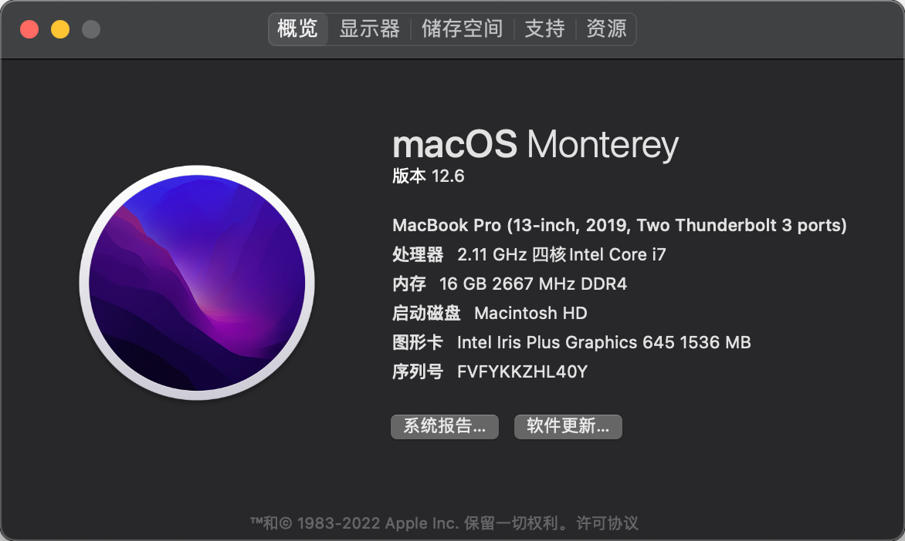
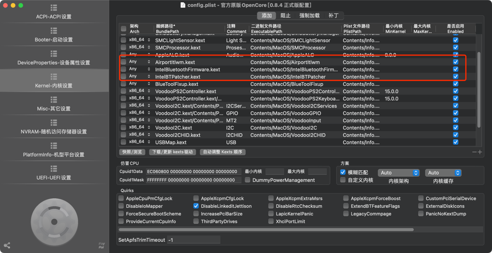

最近在闲鱼上购入了一台2020版的联想小新 Pro13，i5 10200u 16g 512g配置，Ax201网卡。
这台机子原生硬件就可以完美黑苹果了，不需要更换配件。只是Ax201网卡不能随航和隔空投送，WIFI和蓝牙能正常使用，要想随航和隔空投送得更换网卡。
### 安装过程
我是根据黑果小兵的教程刷入黑苹果系统，整体跟着教程来就行了
> 教程及资源链接
> - [https://github.com/daliansky/XiaoXinPro-13-hackintosh](https://github.com/daliansky/XiaoXinPro-13-hackintosh)
> - [https://blog.daliansky.net/Lenovo-Xiaoxin-PRO-13-2019-and-macOS-Catalina-Installation-Tutorial.html](https://blog.daliansky.net/Lenovo-Xiaoxin-PRO-13-2019-and-macOS-Catalina-Installation-Tutorial.html)



需要注意的事，最新版的 EFI 文件里没有网卡和蓝牙的驱动，需要自己挂载驱动
> 网卡驱动下载：[https://github.com/OpenIntelWireless/itlwm/releases](https://github.com/OpenIntelWireless/itlwm/releases)
> 蓝牙驱动下载：[https://github.com/OpenIntelWireless/IntelBluetoothFirmware/releases](https://github.com/OpenIntelWireless/IntelBluetoothFirmware/releases)
> 注意蓝牙驱动 v2.2.0 版本，IntelBluetoothInjector.kext 被弃用，请不要配置！
网上很多教程用到的蓝牙驱动都是旧版本的，旧版本是使用 IntelBluetoothInjector 的，新版本弃用！
具体看：[https://openintelwireless.pages.dev/IntelBluetoothFirmware/FAQ.html#what-does-this-kext-do](https://openintelwireless.pages.dev/IntelBluetoothFirmware/FAQ.html#what-does-this-kext-do)

我是用 Opencore 引导系统的，所以需要修改 OC 配置文件
需要下载 opencore configurator 软件来方便我们修改配置文件，请自行 Google
将红框内三个驱动文件挂载到配置文件里，保存配置文件并退出即可


### 外接2K显示器
我外接了个戴尔 U2518d 2k 显示器，因为外接显示器字体太小，所以需要开 Hidpi
一键开启Hidpi命令
```shell
bash -c "$(curl -fsSL https://raw.githubusercontent.com/xzhih/one-key-hidpi/master/hidpi.sh)"
```
来源：
[https://github.com/xzhih/one-key-hidpi](https://github.com/xzhih/one-key-hidpi)

开启Hidpi后，我会出现外接显示器上动画不流畅，原因是黑苹果只能用 uhd620 显卡，显卡支撑不了 Hidpi 所需的性能，所以会卡顿不流畅。应该外接 1080P 显示器就没啥问题了。
在笔记本显示器上显示没有任何问题，动画很流畅。
### 性能表现
Mac有自己的优秀电源管理机制，日常浏览网页 CPU 功耗平均 5W 左右。持续烤机跑 R23 CPU能稳定在 35W 的水平。当然可以在 BIOS 中设置 CPU 的性能释放。
具体可以参考：[https://www.bilibili.com/read/cv15761897?spm_id_from=333.999.0.0](https://www.bilibili.com/read/cv15761897?spm_id_from=333.999.0.0)
### 存在问题

- 睡眠后必须得长按电源键 2s 才能唤醒
   - 笔记本必须得开盖状态下才能电源键 2s 唤醒。我外接显示器的时候笔记本基本都是合盖状态，每次睡眠唤醒得开盖，很麻烦。
      - SleeperX 可以解决睡眠问题。通过软件可以让笔记本不进入深度睡眠，不深度睡眠屁事没有。[https://github.com/HsOjo/SleeperX](https://github.com/HsOjo/SleeperX)
- 外接 2k 显示器动画卡顿，这点很影响我的使用体验。
- 电脑内置麦克风不能用。对我没啥影响
- 外接 2.4G 键盘一直断连。键盘 5s 没使用就会断联，必须得重新按一下按键重新连接才能使用。不知道是不是我的键盘问题，键盘是腹灵FL680
### 总体评价
如果你是直接使用笔记本屏幕来办公，那体验会很不错，几乎接近白苹果。
但像我一样外接显示器，笔记本当主机使用，体验就会很糟糕。2.4G 键盘断联，外接 2K 显示器动画不流畅，偶尔需要开盖才能开机或唤醒。除了以上问题，其他方面的体验也接近白苹果体验。
目前我是打算用这台笔记本外出办公使用，桌面主机我准备搞一台联想 M710Q 黑苹果小主机，还没到货，如果小主机体验还不错的话就打算出掉这台笔记本了 
