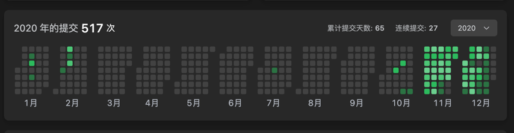

# 关于我
Danny M, 00后程序员，2022年毕业于东莞理工学院。喜欢技术、思考哲学。

## 大学经历 2018.09 ~ 2021.06
我大一大二主要在混社团，当时在师友电脑维修部内干事，给校内外师生进行免费的电脑维修服务，期间夹杂着自己的一些私活，赚点生活费。这段时期主要做的是：**高密度地与陌生人交流，如何快速打开话题，积累人脉**

大三上才开始系统学编程，有俩个月的时间沉迷于刷力扣，俩个月提交了近 500 次。
后面开始准备面试，背背八股文，2021年5月份拿到稳健医疗的软件开发实习生的 offer，前往深圳开始实习生涯。

## 天元云 2021.07 ~ 2022.06 
天元云是我梦开始的地方

