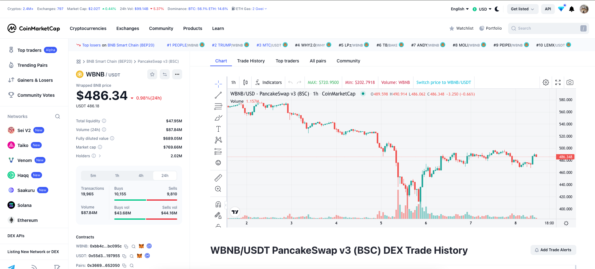
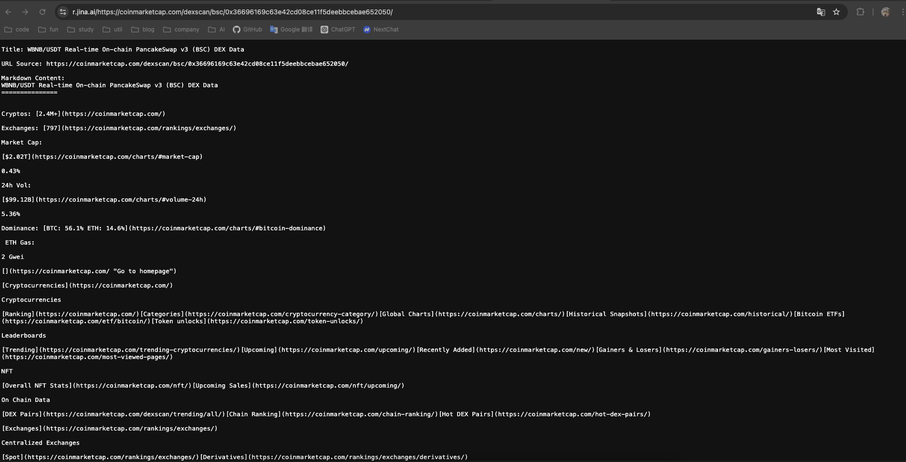
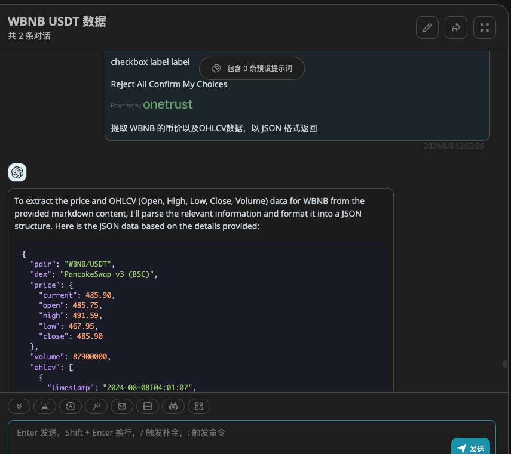

本文介绍如何通过 jina reader 和 llm 快速爬虫并提取出结构化数据

jina reader:

- [https://jina.ai/reader/](https://jina.ai/reader/)，提供了一个爬虫 api，能抓取网页内容并返回 markdown 文本

我现在需要爬取这个页面，获取 WBNB 的币价以及 OHLCV 数据，这些数据在页面上都有提供。下面将展示如何使用俩步，即可获取结构化的数据。



## 流程

1. 页面爬虫：将该页面的链接丢给 jina reader 的 api，[https://r.jina.ai/https://coinmarketcap.com/dexscan/bsc/0x36696169c63e42cd08ce11f5deebbcebae652050/](https://r.jina.ai/https://coinmarketcap.com/dexscan/bsc/0x36696169c63e42cd08ce11f5deebbcebae652050/)，得到 markdown 文本



2. 数据清洗：将上文得到的 Markdown 文本 + 一段 prompt：提取 WBNB 的币价以及OHLCV数据，以 JSON 格式返回。这里只是 for 简单展示，用于代码时，指定好返回的 json 字段结构，并配置 openai response format 为 json 即可。



## 代码示例
```python
def _format_response(_text):
    prompt = f"""
    Find the price of {token_slug} from the provided text and return it in json format.
    Note: 
    1. The price should be returned in digital format in USD. 
    2. You need to pay attention to the order of the trading pairs and make sure {token_slug} is the numerator or denominator. If it is the denominator, you need to calculate its currency price.
    Example:
    {{
        'token_price': 1.00
    }}

    Text:
    {_text}
    """
    _data = chat_response_dict(prompt)
    return _data

url = f"https://r.jina.ai/https://coinmarketcap.com/dexscan/{self.table_chain_name}/{pair_address}/"
headers = {
    'X-No-Cache': 'true'
}
res = requests.get(url, headers=headers)
if res.status_code != 200:
    logging.warning(
        f'请求失败, status_code: {res.status_code}, url: {url}, 有可能是请求的 token_address cmc 没收录没数据')
    continue
data = _format_response(res.text)
token_price = data.get('token_price')
```

## 总结
通过以上方法，我们可以快速的爬取页面内容，并提取出结构化数据，这对于一些简单的爬虫任务是非常有用的。jina reader api 免费版调用量也足够，当然也可以自己实现一个爬虫系统，实现 jina reader api 的功能。