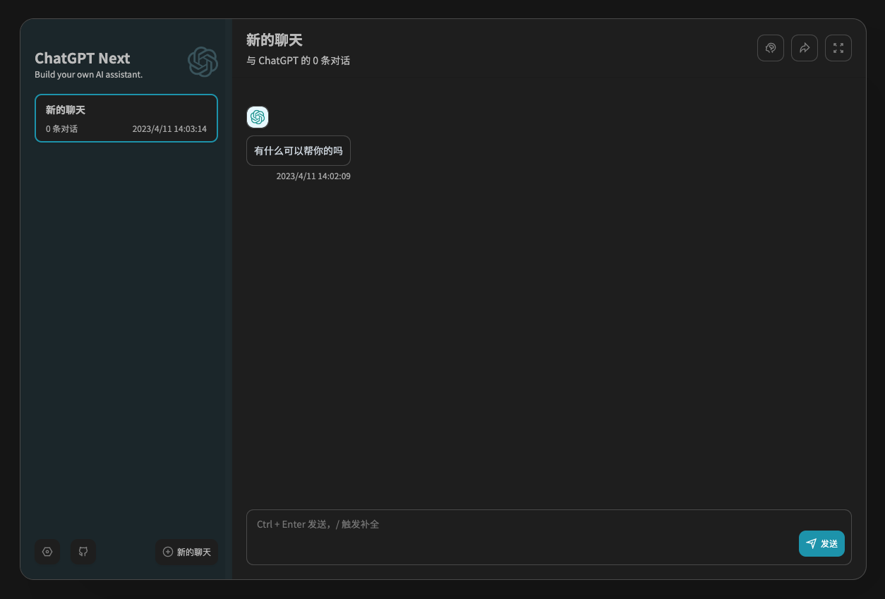

跟着 https://github.com/Yidadaa/ChatGPT-Next-Web 这个项目，5分钟搭建自己的GPT聊天机器人。

使用 Vercel 部署，免费，不用搭建服务器。

步骤:
1. [获取 OpenAI Key](https://platform.openai.com/account/api-keys) 
2. [Deploy In Vercel](Deploy In Vercel)
   1. 输入 OpenAI Key
   2. Code 是你给这个服务定义的密码，用于访问这个服务
3. Enjoy

部署完成后即可打开自己的GPT服务,打开设置输入访问密码(上文的 Code)即可使用
