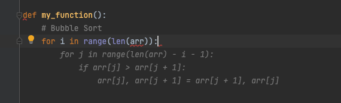
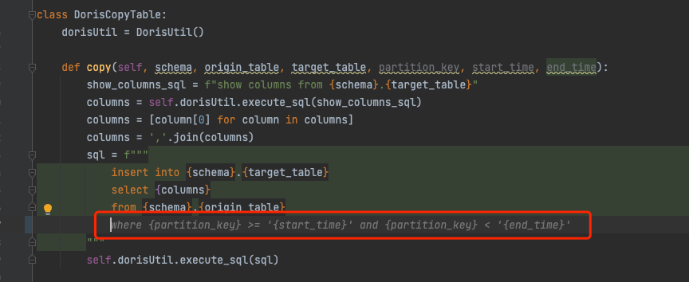
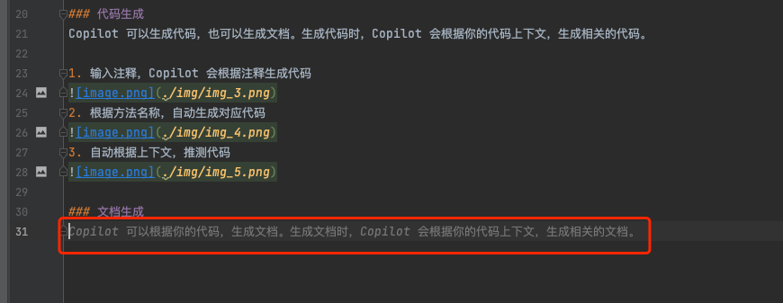
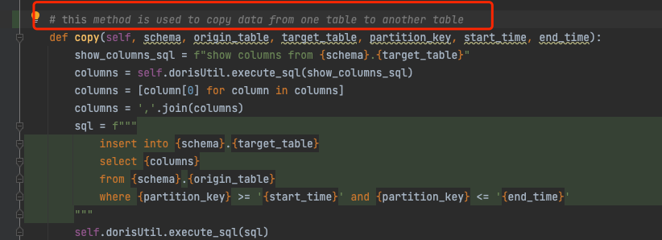
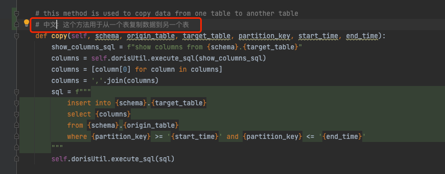

## 前言
Github Copilot 是 Github 推出的一个 AI 代码生成工具，可以帮助开发者生成代码，提高开发效率。经过俩周的使用，探索出一些 Copilot 的使用技巧，分享给大家。

## 使用
### 安装
参考[官方教程](https://docs.github.com/en/copilot/getting-started-with-github-copilot)，安装 Copilot 插件，大致步骤如下：
1. Github 上申请 Copilot 使用资格
2. 安装 Copilot 插件
3. 打开插件登录绑定 Github 账号
4. Enjoy

### 代码生成
Copilot 可以生成代码，也可以生成文档。生成代码时，Copilot 会根据你的代码上下文，生成相关的代码。

1. 输入注释，Copilot 会根据注释生成代码

2. 根据方法名称，自动生成对应代码

3. 自动根据上下文，推测代码

### 文档生成
Copilot 可以根据你的上下文，生成文档。
1. 自动根据上下文，生成文档，提供写作思路

### 代码解释
Copilot 可以根据你的代码，解释代码的含义。
1. 在方法上，输入注释，Copilot 自动解释代码

### 翻译
Copilot 可以根据你的代码，翻译成其他语言。

## 总结
Copilot 对于我来说，像是一个更全面的自动补全工具，可以帮助我快速生成业务代码和文档。减少去查阅文档的时间，能够让我专注于业务逻辑的实现。
我还在使用 Copilot 去学习一门新的编程语言，非常好用。能够自动帮我修正语法错误，快速熟悉语法和一些常用的工具库。
总而言之，Copilot + ChatGPT 能够覆盖我日常开发的 70% 的场景，让我的开发效率提高了 2 倍以上，非常好用，欢迎大家尝试。