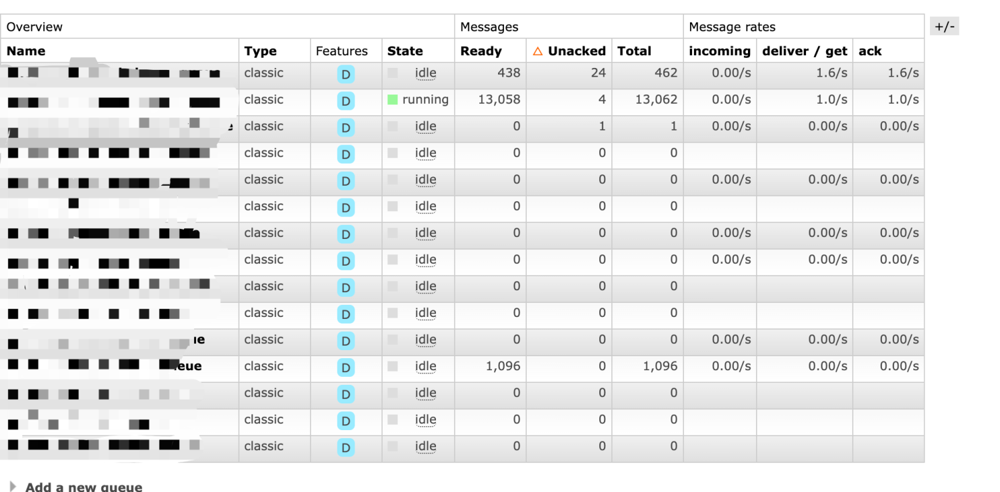
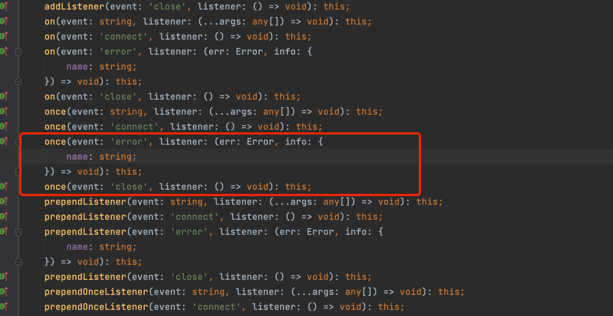

## 背景
公司有个项目专门做从外部接口取数的，为了保证取数程序的稳定性，我们引入了RabbitMQ，主要用上了MQ的错误重试机制、MQ的分布式的生产消费能力，还有消息处理的可视化能力。基于这些，方便我们安心将任务放在上面跑，并且能水平扩容消费进程数，还可以清晰知道每个队列的任务消费情况。

## 问题
程序跑了一段时间后发现，MQ消息堆积严重，消息没有消费者消费，消费者无端消失了。
我们这里的每一个 consumer 都绑定了一个 channel，看程序 log 发现，是因为 consumer 的 channel close 掉了，消费依赖于 channel，channel 必须存在，程序才能正常消费。
而 channel close 的原因太多了，有很多不可控的因素。所以我们得思考如何让程序适应 channel 会关闭这一状况，还能正常消费。
## 解决思路
既然 channel 会 close掉，那我们在 channel 关闭后重新创建 channel 不就行了吗？
于是要考虑怎么让程序识别这个消费者的 channel 状态和如何重新创建 channel。
我们程序是用 amqp 这个包连接 mq 的，而这个包在在创建 channel 时，对外提供了一些事件注册接口，我们可以实现接口，使 channel 处于不同生命周期时会触发事件。例如在 channel close 时触发动作，告诉我这个消费者的 channel closed。


## 解决方法
我们通过实现 channel close 和 channel error 的接口，在每一个 consumer 实例里设置一个状态量 channelAlive，用来判断当前 consumer 的 channel 是否存活。
当 channel 关闭和发生异常时，将变量 channelAlive 设置为 false，告诉消费者 channel 关闭。
然后设置一个定时程序，每分钟去检测 channelAlive 这个状态，为 false 时重新创建 channel。
具体见代码：
```typescript
private channelAlive = true

async onModuleInit() {
  const mq = this.mqHelper.getMqConnection()
  const channel = await mq.connection.createChannel()
  await channel.assertQueue(queue)
  await channel.prefetch(preFetch)
  await this.registerChannelEvent(queue, channel)
  this.channelAlive = true
  try {
    await channel.consume(queue, async (msg: any) => {
      // doing something
    })
  } catch (e) {
    this.channelAlive = false
    console.error(`mq consume channel:${queue} error: ${e}`, e)
  }
}

private async registerChannelEvent(queueName: any, channel: any) {
    const that = this
    channel.once('error', function () {
      console.error(queueName, 'channel trigger error')
      that.channelAlive = false
    })
    channel.once('close', function () {
      console.error(queueName, 'channel trigger close')
      that.channelAlive = false
    })
}

/**
   * 定时重连MQ队列
   * 因为程序运行时因为各种因素失去了MQ的连接，重连后他是不会主动去拉取队列中的信息进行消费的，所以需要进行此操作
   */
  async reconnection() {
    schedule.scheduleJob('0 */1 * * * *', async () => {
      if (!this.channelAlive) {
        console.error(this.queueName, 'channel close, reconnecting')
        await this.onModuleInit()
      }
    });
  }
```
## 总结
通过以上方法，消费者就永远不会下线，拥有了 "永生" 的消费能力。不过上述实现是基于定时器去重新创建 channel，会有一段时间间隔消费者不可用。如果要求比较高的话，可以改下程序，在 channel close时立即创建 channel 即可。
