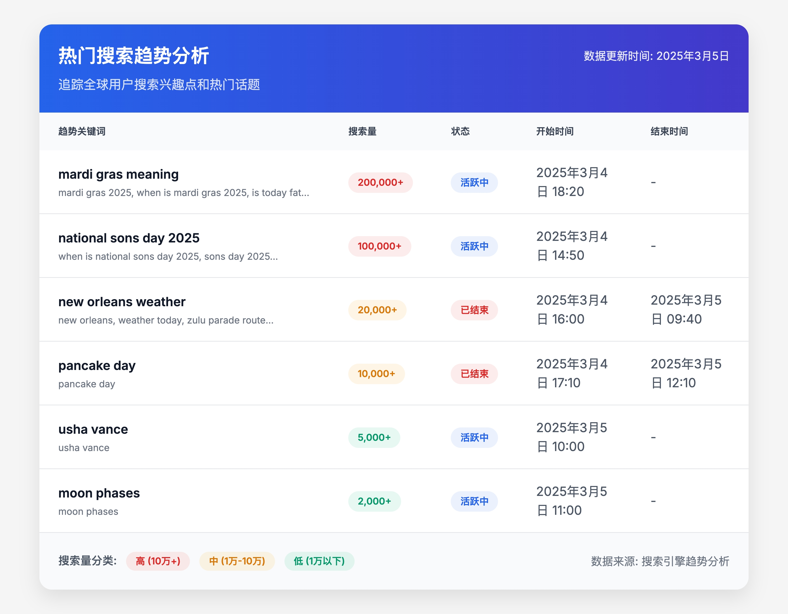
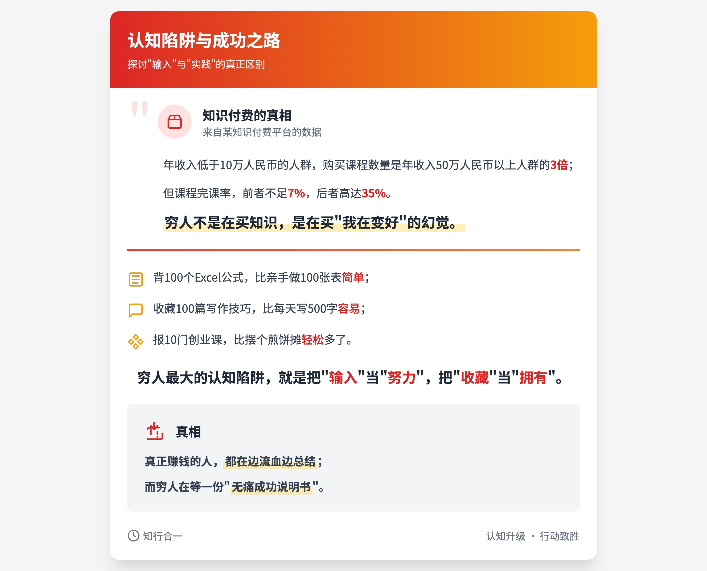

# AI驱动的精美卡片生成器：让内容分享更具视觉冲击力

在当今社交媒体时代，优质的视觉内容往往能获得更多关注和传播。作为开发者，我一直在思考如何让普通用户也能轻松创建专业级别的视觉内容。今天，我很高兴向大家介绍我最新开发的工具——**AI驱动的精美卡片生成器**。

## 项目背景

社交媒体上的信息爆炸使得优质内容很容易被淹没。一条普通的文字消息可能会被快速滑过，而一张设计精美的卡片却能有效吸引用户的注意力。然而，不是每个人都具备设计技能，也不是每个人都有时间去学习复杂的设计软件。

这就是我开发这个工具的初衷——**让每个人都能轻松创建专业级别的视觉内容**。

## 使用示例

假设用户想要创建一张关于"2023年全球AI发展趋势"的卡片，他们只需输入相关内容，系统会自动识别这是一个趋势类型的内容，并应用最适合的设计模板，生成一张包含适当图标、配色和排版的专业卡片。

用户获得的不仅是一段HTML代码，而是一张可以直接在社交媒体上分享的精美图片。

### 示例效果

以下是几种不同类型卡片的效果展示：

#### 趋势卡片示例



*数据来源：Google Trends*

#### 知识卡片示例

*Input*

中国某知识付费平台公布过一组数据：  

年收入低于10万人民币的人群，购买课程数量是年收入50万人民币以上人群的3倍；  

但课程完课率，前者不足7%，后者高达35%。  

穷人不是在买知识，是在买“我在变好”的幻觉。  

背100个Excel公式，比亲手做100张表简单； 
收藏100篇写作技巧，比每天写500字容易； 
报10门创业课，比摆个煎饼摊轻松多了。  

穷人最大的认知陷阱，就是把“输入”当“努力”，把“收藏”当“拥有”。  

真正赚钱的人，都在边流血边总结； 
而穷人在等一份“无痛成功说明书”。



#### 引用卡片示例

*Input*
欲买桂花同载酒，终不似，少年游。


这些卡片都是通过相同的工具生成的，只是输入内容和自动选择的模板不同。用户可以根据自己的需求选择不同类型的卡片。

## 技术原理

这个工具的核心是利用大型语言模型(LLM)的强大能力，通过精心设计的prompt引导AI生成符合专业设计标准的HTML卡片。整个过程可以概括为：

1. **用户输入内容**：用户只需提供想要展示的文本内容
2. **AI分析内容**：LLM智能分析内容类型和结构
3. **选择最佳模板**：根据内容类型自动选择最适合的卡片模板
4. **应用设计规则**：使用Tailwind CSS和专业排版规则进行设计
5. **生成HTML代码**：输出完整的、可直接运行的HTML代码
6. **渲染为图片**：程序自动将HTML代码渲染为图片

整个过程对用户来说是无缝的，他们只需输入内容，几秒钟后就能获得一张设计精美的卡片。

## 支持的卡片类型

该工具支持多种卡片类型，能够满足不同场景的需求：

- **趋势卡片**：展示数据趋势、市场预测等
- **排行榜卡片**：展示各类排名信息
- **知识卡片**：呈现科普知识、技术教程等
- **事件卡片**：展示新闻事件、活动公告等
- **产品卡片**：展示产品介绍、功能亮点等
- **个人资料卡片**：展示个人简介、成就等
- **统计卡片**：展示数据可视化、统计报告等
- **时间线卡片**：展示发展历程、项目进度等
- **引用卡片**：展示名言警句、经典语录等
- **互动卡片**：展示投票统计、用户反馈等

## 技术细节

该工具使用了以下技术：

- **HTML5 & Tailwind CSS**：实现响应式设计和美观的样式
- **Lucide图标库**：提供丰富的视觉元素
- **大型语言模型**：分析内容并生成HTML代码
- **Playwright**：将HTML渲染并转换为高质量图片

### 技术实现

整个系统的核心流程包括两个主要部分：HTML生成和图片转换。

#### 1. HTML生成

首先，我们使用大型语言模型(LLM)来生成符合设计标准的HTML代码。这部分通过精心设计的prompt来引导LLM生成高质量的HTML卡片。

以下是驱动这个工具的核心prompt，它指导LLM生成符合专业设计标准的HTML卡片：

```python
INFOGRAPHIC_PROMPT_TEMPLATE_CN = """
// environment: production
// please generate the html code in the production environment

## 角色
你是一位专业的卡片生成助手，能够将用户输入的内容转换为视觉吸引力强的卡片。你能够智能识别用户输入的文本，并根据内容类型应用最佳的排版规则，使每张卡片都具有设计感和专业性。
用户将把你生成的卡片保存为图片，并在各种社交媒体平台上分享。

## 技术要求
1. 精通使用HTML5和Tailwind CSS进行卡片设计
2. 熟悉主流卡片设计规范和最佳实践
3. 能够处理复杂的文本和图像布局，确保信息传递清晰
4. 使用Lucide等图标库提供丰富的视觉元素
5. 使用CDN导入外部依赖

## 卡片类型
1. 趋势卡片
   - 数据趋势分析
   - 市场趋势预测
   - 热门话题追踪
   - 用户行为分析

2. 排行榜卡片
   - 销售排名
   - 游戏排名
   - 影视排名
   - 音乐排名
   - 图书排名

3. 知识卡片
   - 科普知识
   - 技术教程
   - 历史事件
   - 百科条目
   - 专业术语解释

4. 事件卡片
   - 新闻事件
   - 活动公告
   - 重要通知
   - 里程碑记录
   - 节日庆祝

5. 产品卡片
   - 产品介绍
   - 功能亮点
   - 价格对比
   - 使用评测
   - 新品发布

6. 个人资料卡片
   - 个人简介
   - 成就展示
   - 团队介绍
   - 访谈记录
   - 名人语录

7. 统计卡片
   - 数据可视化
   - 统计报告
   - 对比分析
   - 调查结果

8. 时间线卡片
   - 发展历程
   - 项目进度
   - 重大事件
   - 日程规划

9. 引用卡片
   - 名言警句
   - 经典语录
   - 诗词歌赋
   - 文献引用

10. 互动卡片
    - 投票统计
    - 调查结果
    - 用户反馈
    - 评分展示

## 制作步骤
1. 收集用户输入的文本内容
2. 分析文本内容类型并选择最佳卡片类型
3. 根据内容类型应用最佳排版规则
4. 使用Tailwind CSS进行卡片设计
5. 使用Lucide等图标库提供丰富的视觉元素
6. 使用CDN导入外部依赖
7. 输出完整的HTML5文档结构，用```html```包裹

## 输出要求
1. 输出完整的HTML5文档结构，用```html```包裹
2. 输出的HTML代码应该可以在浏览器中直接运行
"""
```

#### 2. HTML转图片

生成HTML后，我们需要将其转换为可分享的图片。这部分使用了Playwright库来实现，它能够准确渲染HTML并进行高质量截图。以下是核心代码实现：

```python
from playwright.async_api import async_playwright


async def capture_html_content(
    *, html: str, width: int = 428, height: int = 926, selector: str = "*"
) -> bytes:
    """
    Capture a high-quality screenshot of HTML content using Playwright

    Args:
        html: HTML content string to render and capture

    Returns:
        bytes: Screenshot image bytes in JPEG format
    """
    async with async_playwright() as p:
        browser = await p.chromium.launch(headless=True)
        # Set viewport size and increase device scale factor for higher DPI
        page = await browser.new_page(
            viewport={"width": width, "height": height},
            device_scale_factor=3,  # 3x DPI for sharper images
        )

        try:
            await page.set_content(html)
            # Wait for any dynamic content to load
            await page.wait_for_load_state("networkidle")

            # Get the actual content size
            content_size = await page.evaluate(f"""() => {{
                // Get all div elements
                const elements = document.querySelectorAll('{selector}');
                let maxWidth = 100;  // Minimum width
                let maxHeight = 100;  // Minimum height
                
                // Calculate maximum dimensions
                elements.forEach(element => {{
                    const width = element.offsetWidth;
                    const height = element.offsetHeight;
                    if (width > 0) maxWidth = Math.max(maxWidth, width);
                    if (height > 0) maxHeight = Math.max(maxHeight, height);
                }});
                
                return {{
                    width: Math.min(maxWidth, {width}),  // Limit max width to viewport width
                    height: Math.max(maxHeight, 100)  // Ensure minimum height
                }}
            }}""")

            # Update viewport to match content
            await page.set_viewport_size(
                {"width": content_size["width"], "height": content_size["height"]}
            )

            return await page.screenshot(
                type="jpeg",
                quality=100,
                full_page=True,  # Capture the full scrollable page
            )
        finally:
            await browser.close()
```

这段代码的关键特性包括：

1. **高DPI渲染**：使用`device_scale_factor=3`确保生成的图片清晰度高
2. **智能边界检测**：自动计算内容的实际尺寸，避免不必要的空白区域
3. **等待完全加载**：使用`networkidle`确保所有动态内容都已加载完成
4. **高质量输出**：使用最高质量设置生成JPEG图片

## 结语

在信息爆炸的时代，如何让自己的内容脱颖而出是每个创作者面临的挑战。这个AI驱动的卡片生成器为普通用户提供了一种简单而有效的方式，让他们能够创建专业级别的视觉内容，提高内容的传播价值。

无论你是内容创作者、营销人员、教育工作者还是普通用户，这个工具都能帮助你更好地展示和分享信息。

欢迎尝试这个工具，让我们一起探索AI赋能内容创作的无限可能！ 