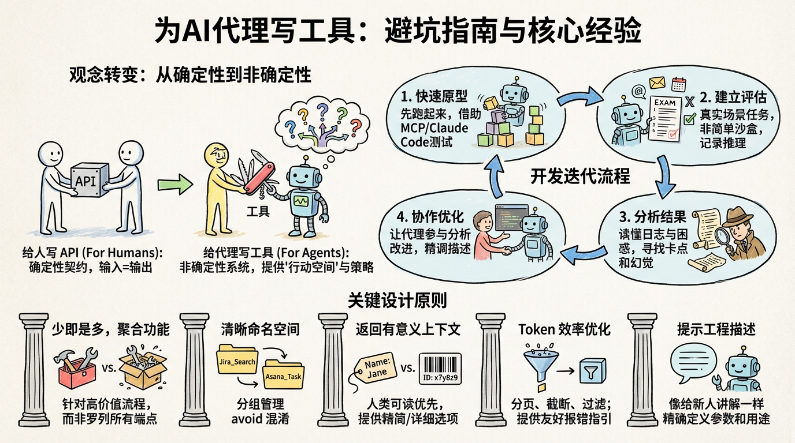

# 为 AI 代理写工具：我踩过的坑和学到的经验

说实话，当我第一次给 Claude 写工具的时候，心里想的是"这不就是写个 API 嘛"。结果跑起来才发现，代理要么不调用工具，要么调错参数，要么拿到结果后一脸懵逼。那段时间我盯着日志发呆，怀疑是不是模型有问题。

后来才明白：**给代理写工具，和给人写 API，完全是两回事。**

## 问题背景

传统软件开发里，我们写的是确定性系统之间的契约。比如 `getWeather("NYC")` 这个函数，每次调用都会用完全相同的方式获取纽约的天气。输入确定，输出确定，行为确定。

但代理不一样。当用户问"今天要不要带伞？"，代理可能：
- 调用天气工具查询
- 直接从知识库回答
- 先问你在哪个城市
- 甚至幻觉一个答案出来

这就是**非确定性系统**的特点。同样的输入，可能产生完全不同的输出和策略。

这意味着我们需要重新思考如何设计工具：不是为确定性的程序写接口，而是为非确定性的代理设计"行动空间"。目标是让代理在解决各种任务时，能用多种策略成功完成。

## 解决思路

经过大量实践，我总结出一套完整的工具开发流程：

### 快速搭建原型

别想太多，先写个能跑的版本。我一般会让 Claude Code 帮我快速生成工具原型，特别是当工具需要调用第三方 API 或 SDK 的时候。

关键是把工具包装成 MCP 服务器（Model Context Protocol）或 Desktop 扩展（DXT），这样就能直接在 Claude Code 或 Claude Desktop 里测试。

```bash
# 连接本地 MCP 服务器到 Claude Code
claude mcp add <name> <command> [args...]
```

自己先用用，感受一下哪里不顺手。收集用户反馈，建立对真实使用场景的直觉。

### 建立评估体系

这是最关键的一步。没有评估，你根本不知道改进是好是坏。

**生成评估任务**

让 Claude Code 帮你生成几十个测试用例。这些用例必须基于真实场景，用真实的数据源和服务。别搞那种"沙盒环境"，太简单的测试发现不了问题。

好的评估任务长这样：

> 帮我约 Jane 下周开会讨论 Acme Corp 项目。附上上次项目规划会议的笔记，预订一个会议室。

> 客户 ID 9182 反馈他们被重复扣款三次。找出所有相关日志，看看有没有其他客户遇到同样的问题。

> 客户 Sarah Chen 刚提交了取消请求。准备一个挽留方案。确定：(1) 她为什么要走，(2) 什么样的优惠最有吸引力，(3) 有没有风险因素需要注意。

差的评估任务长这样：

> 约 jane@acme.corp 下周开会。

> 搜索支付日志里的 purchase_complete 和 customer_id=9182。

> 找到客户 ID 45892 的取消请求。

每个任务都要配一个可验证的答案。验证器可以简单到字符串比对，也可以复杂到让 Claude 来判断答案是否正确。别太严格，不要因为格式、标点这些无关紧要的差异就判错。

你还可以记录期望的工具调用序列，用来衡量代理是否理解了每个工具的用途。但别过度拟合某种特定策略——通常有多条路能走到终点。

**运行评估**

直接用 API 调用来跑评估，别用 UI。写个简单的循环：每个任务启动一个代理，给它任务提示词和工具，让它自己跑。

在系统提示词里，建议让代理输出推理过程和反馈。这能触发链式思考（Chain of Thought），提升模型的有效智能。如果用 Claude，可以直接开启 extended thinking 功能。

除了准确率，还要记录：
- 每个工具调用的耗时
- 总工具调用次数
- token 消耗
- 工具报错次数

这些指标能揭示代理的工作流程，也能发现优化机会。比如大量重复调用可能说明分页参数设置不合理；大量参数错误可能说明工具描述不够清晰。

我们上线 Claude 的网页搜索工具时，就发现 Claude 总是在查询后面加 `2025`，导致搜索结果有偏差。后来改进了工具描述，问题就解决了。

### 分析结果

代理是你的好帮手。它能帮你发现工具描述矛盾、实现低效、参数结构混乱等问题。但要注意，**代理没说的，往往比说的更重要**。LLM 不总是能准确表达自己的困惑。

仔细看评估日志。看代理在哪里卡住了，在哪里搞混了。读它的推理过程（或 CoT），找出粗糙的边缘。看原始记录（包括工具调用和返回），捕捉那些没在 CoT 里明说的行为。

读懂字里行间的意思。记住，你的评估代理不一定知道正确答案和策略。

分析工具调用指标。大量重复调用可能需要调整分页或 token 限制参数；大量参数错误可能需要更清晰的描述或更好的示例。

### 与代理协作优化

你甚至可以让代理帮你分析结果、改进工具。把评估日志拼起来，扔给 Claude Code。Claude 很擅长分析日志、重构大量工具——比如确保工具实现和描述保持一致。

实际上，这篇文章里的大部分建议，都是我们用 Claude Code 反复优化内部工具时总结出来的。我们的评估基于真实的内部工作空间，包含真实的项目、文档和消息，复杂度和实际工作流程一致。

我们用留出测试集（held-out test set）来确保没有过拟合。测试集显示，即使是"专家"手写的工具，也能通过 Claude 的优化获得额外的性能提升——无论这些工具是研究员手写的，还是 Claude 自己生成的。

<thinking>
我需要继续写完文章的其余部分，包括工具设计的关键原则。让我继续写。
</thinking>

## 工具设计的关键原则

在这个过程中，我学到了一些设计有效工具的核心原则。

### 选择合适的工具

**工具不是越多越好。** 这是我踩过的最大的坑。

一个常见错误是把现有的 API 端点一股脑包装成工具——不管这些工具对代理是否合适。问题在于，代理和传统程序有不同的"可供性"（affordances）——也就是它们感知和执行动作的方式不同。

LLM 代理的上下文是有限的（能处理的信息量有上限），而计算机内存又便宜又充足。想象一下在通讯录里找联系人。传统程序可以高效地逐个检查联系人，一个接一个处理。

但如果 LLM 代理用一个返回所有联系人的工具，然后逐个 token 地读，那就是在浪费宝贵的上下文空间处理无关信息（就像你在通讯录里从头到尾一页页翻——纯暴力搜索）。更好更自然的方式是直接跳到相关页面（比如按字母顺序找）。

我建议：**先做几个精心设计的高影响力工具，针对具体的高价值工作流程**，和你的评估任务匹配，然后再扩展。

在通讯录的例子里，你应该实现 `search_contacts` 或 `message_contact` 工具，而不是 `list_contacts`。

工具可以整合功能，在底层处理多个离散操作（或 API 调用）。比如，工具可以在返回结果时附带相关元数据，或者把经常连续执行的多步任务合并到一个工具调用里。

举几个例子：

- 与其实现 `list_users`、`list_events`、`create_event` 三个工具，不如实现一个 `schedule_event` 工具，它能找到可用时间并直接安排会议。
- 与其实现 `read_logs` 工具，不如实现 `search_logs` 工具，只返回相关的日志行和一些上下文。
- 与其实现 `get_customer_by_id`、`list_transactions`、`list_notes` 三个工具，不如实现一个 `get_customer_context` 工具，一次性编译客户的所有近期相关信息。

确保每个工具都有清晰、独特的目的。工具应该让代理能像人一样分解和解决任务——如果人能访问同样的底层资源，会怎么做？同时减少那些本来会被中间输出消耗的上下文。

太多工具或功能重叠的工具会分散代理的注意力，让它无法追求高效策略。仔细、有选择性地规划要做（或不做）哪些工具，真的很值得。

### 命名空间设计

你的 AI 代理可能会访问几十个 MCP 服务器、上百个不同的工具——包括其他开发者写的。当工具功能重叠或目的模糊时，代理会搞混该用哪个。

**命名空间**（把相关工具归到共同前缀下）能帮助划清大量工具之间的界限；MCP 客户端有时会默认这么做。比如，按服务命名（如 `asana_search`、`jira_search`）和按资源命名（如 `asana_projects_search`、`asana_users_search`），能帮助代理在正确的时机选择正确的工具。

我们发现，选择前缀还是后缀命名，对工具使用评估有非平凡的影响。效果因 LLM 而异，建议你根据自己的评估来选择命名方案。

代理可能会调错工具、用错参数、调用次数不够、或者处理工具返回时出错。通过有选择性地实现那些名字反映任务自然划分的工具，你同时减少了加载到代理上下文中的工具数量和工具描述，并把代理的计算从上下文卸载回工具调用本身。这降低了代理犯错的整体风险。

### 返回有意义的上下文

同样的道理，工具实现应该只返回高信号的信息给代理。优先考虑上下文相关性而不是灵活性，避免低级技术标识符（比如：`uuid`、`256px_image_url`、`mime_type`）。像 `name`、`image_url`、`file_type` 这样的字段更可能直接影响代理的后续行动和响应。

代理处理自然语言的名称、术语或标识符，比处理神秘的标识符要成功得多。我们发现，仅仅是把任意的字母数字 UUID 解析成更有语义、更可解释的语言（甚至是从 0 开始的 ID 方案），就能显著提升 Claude 在检索任务中的精确度，减少幻觉。

有些情况下，代理可能需要灵活地同时处理自然语言和技术标识符输出，哪怕只是为了触发下游工具调用（比如 `search_user(name='jane')` → `send_message(id=12345)`）。你可以通过暴露一个简单的 `response_format` 枚举参数来实现，让代理控制工具返回"简洁"还是"详细"响应。

你可以添加更多格式来获得更大的灵活性，类似 GraphQL，你可以精确选择想要接收的信息片段。下面是一个控制工具响应详细程度的 `ResponseFormat` 枚举示例：

```typescript
enum ResponseFormat {
   DETAILED = "detailed",
   CONCISE = "concise"
}
```

详细响应示例（206 tokens）：

```json
{
  "messages": [
    {
      "thread_ts": "1234567890.123456",
      "channel_id": "C01234567",
      "user_id": "U01234567",
      "user_name": "Jane Doe",
      "text": "Can we schedule a meeting to discuss the Q4 roadmap?",
      "timestamp": "2025-01-15T10:30:00Z",
      "reply_count": 3
    }
  ]
}
```

简洁响应示例（72 tokens）：

```json
{
  "messages": [
    {
      "user": "Jane Doe",
      "text": "Can we schedule a meeting to discuss the Q4 roadmap?",
      "replies": 3
    }
  ]
}
```

Slack 的线程和回复由唯一的 `thread_ts` 标识，获取回复时需要这个 ID。`thread_ts` 和其他 ID（`channel_id`、`user_id`）可以从"详细"响应中获取，用于需要这些 ID 的后续工具调用。"简洁"响应只返回线程内容，排除 ID。在这个例子里，"简洁"响应只用了约 ⅓ 的 tokens。

甚至工具响应的结构——比如 XML、JSON 还是 Markdown——都会影响评估性能：没有万能方案。这是因为 LLM 是基于下一个 token 预测训练的，在匹配训练数据的格式上表现更好。最优的响应结构因任务和代理而异。建议你根据自己的评估选择最佳响应结构。

### 优化 token 效率

优化上下文的质量很重要。但优化工具返回给代理的上下文数量也很重要。

我建议对任何可能消耗大量上下文的工具响应，实现分页、范围选择、过滤和/或截断的某种组合，并设置合理的默认参数值。对于 Claude Code，我们默认将工具响应限制在 25,000 tokens。我们预期代理的有效上下文长度会随时间增长，但对上下文高效工具的需求会持续存在。

如果你选择截断响应，一定要用有用的指令引导代理。你可以直接鼓励代理追求更 token 高效的策略，比如在知识检索任务中做多次小而精准的搜索，而不是一次大而宽泛的搜索。同样，如果工具调用抛出错误（比如输入验证时），你可以对错误响应进行提示工程，清晰地传达具体的、可操作的改进建议，而不是晦涩的错误代码或堆栈跟踪。

截断响应示例：

```
搜索结果已截断（返回前 100 条，共 1,247 条匹配）。
建议：使用更具体的搜索词或添加过滤条件来缩小范围。
```

不好的错误响应：

```
Error: Invalid input
Code: 400
```

好的错误响应：

```
参数错误：date_range 格式不正确。
期望格式：YYYY-MM-DD to YYYY-MM-DD
示例：2025-01-01 to 2025-01-31
你的输入：Jan 1 to Jan 31
```

工具截断和错误响应可以引导代理采用更 token 高效的工具使用行为（使用过滤器或分页），或者给出正确格式化工具输入的示例。

### 提示工程你的工具描述

现在来到最有效的改进方法之一：**对工具描述和规范进行提示工程**。因为这些会加载到代理的上下文中，它们可以共同引导代理采用有效的工具调用行为。

写工具描述和规范时，想象你在向团队新人解释这个工具。考虑你可能隐含带入的上下文——专门的查询格式、小众术语的定义、底层资源之间的关系——把它们明确说出来。通过清晰描述（并用严格的数据模型强制执行）预期的输入和输出来避免歧义。特别是，输入参数应该命名明确：与其用 `user` 参数，不如用 `user_id`。

通过评估，你可以更有信心地衡量提示工程的影响。即使是对工具描述的小改进也能带来显著提升。Claude Sonnet 3.5 在 SWE-bench Verified 评估上达到了最先进的性能，就是在我们对工具描述做了精确改进之后，大幅降低了错误率，提高了任务完成度。

你可以在我们的开发者指南中找到工具定义的其他最佳实践。如果你在为 Claude 构建工具，我还建议阅读工具是如何动态加载到 Claude 系统提示词中的。如果你在为 MCP 服务器编写工具，工具注解可以帮助披露哪些工具需要开放世界访问或会做破坏性更改。

## 关键洞察

| 原则           | 要点                                   | 为什么重要                     |
| -------------- | -------------------------------------- | ------------------------------ |
| 选择合适的工具 | 少而精，针对高价值工作流程             | 太多工具会分散代理注意力       |
| 命名空间       | 按服务或资源分组                       | 帮助代理选择正确的工具         |
| 有意义的上下文 | 返回自然语言标识符，避免技术 ID        | 减少幻觉，提高精确度           |
| Token 效率     | 分页、过滤、截断，设置合理默认值       | 节省上下文空间，提高效率       |
| 提示工程       | 清晰描述工具用途、参数、预期行为       | 小改进能带来显著性能提升       |

## 总结

为代理构建有效工具，需要我们重新调整软件开发实践——从可预测的确定性模式转向非确定性模式。

通过我在这篇文章里描述的迭代、评估驱动的过程，我们发现了工具成功的一致模式：**有效的工具是有意图、清晰定义的，明智地使用代理上下文，可以在多样化的工作流程中组合使用，并能让代理直观地解决真实世界的任务。**

未来，我们预期代理与世界交互的具体机制会演进——从 MCP 协议的更新到底层 LLM 本身的升级。通过系统化、评估驱动的方法来改进代理工具，我们可以确保随着代理变得更强大，它们使用的工具也会随之演进。


---

*这篇文章的大部分建议都来自我们用 Claude Code 反复优化内部工具的实践。如果你也在构建 AI 代理工具，希望这些经验能帮你少走弯路。*
