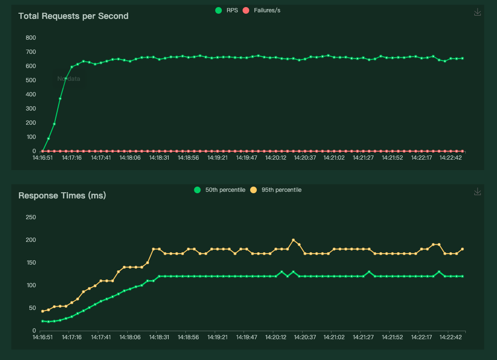

## Apache Benchmark

[https://httpd.apache.org/docs/2.4/programs/ab.html](https://httpd.apache.org/docs/2.4/programs/ab.html)

Linux 中可以使用的压测工具，简单易用。有压测报告输出。

使用方法：`ab -n 1000 -c 10 [http://127.0.0.1:5000/](http://127.0.0.1:5000/)`，向本地 5000端口 10组并发，共发送 1000个请求。

执行 `ab -h` 可以获取使用手册。

```bash
~  ab -n 1000 -c 10 http://127.0.0.1:5000/
Server Software:        Werkzeug/2.2.3
Server Hostname:        127.0.0.1
Server Port:            5000

Document Path:          /
Document Length:        20 bytes

Concurrency Level:      10
Time taken for tests:   0.542 seconds
Complete requests:      1000
Failed requests:        0
Total transferred:      192000 bytes
HTML transferred:       20000 bytes
Requests per second:    1844.83 [#/sec] (mean)
Time per request:       5.421 [ms] (mean)
Time per request:       0.542 [ms] (mean, across all concurrent requests)
Transfer rate:          345.91 [Kbytes/sec] received

Connection Times (ms)
              min  mean[+/-sd] median   max
Connect:        0    0   0.0      0       0
Processing:     1    5   0.9      5      11
Waiting:        1    5   0.9      5      11
Total:          1    5   0.9      5      11

Percentage of the requests served within a certain time (ms)
  50%      5
  66%      5
  75%      6
  80%      6
  90%      6
  95%      7
  98%      8
  99%      9
 100%     11 (longest request)
```

## Python Locust

[https://locust.io/](https://locust.io/)

Python 压测工具，简单易用有UI，能够满足复杂的测试场景。UI 能看到实时的压测报告，可以导出压测报告。

代码：

```python
from locust import HttpUser, task

class HelloWorldUser(HttpUser):

    @task
    def hello_world(self):
        self.client.get("/")
```

报告：

