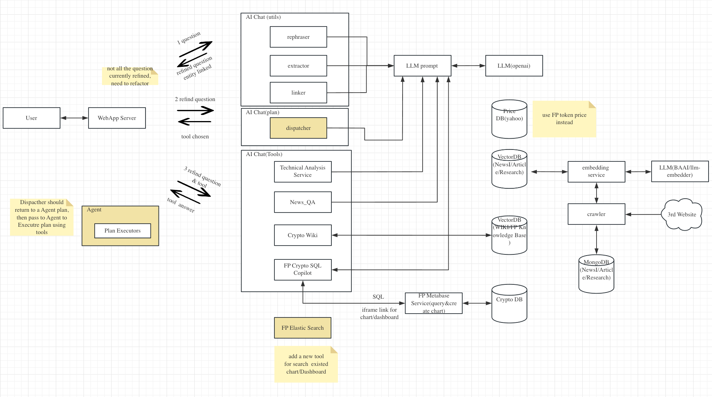

# 基于 LLM 搭建 Crypto AI 分享

项目在线地址：[https://ai.footprint.network/](https://ai.footprint.network/)

## 项目背景

公司最近要开发一款 Crypto 领域的 AI Bot 应用，可以回答用户 crypto 领域的问题。要做到以下功能：

1. bot 是 crypto 领域的专家，它可以回答任何关于 crypto 的问题
2. bot 的回答是基于实时数据生成的，它可以告诉你最近 crypto 的新闻
3. bot 进行数据分析，例如你可以问 bot opensea 最近 7 天的 top10 交互用户是谁，bot 会将数据转化成 BI 报表返回，并给予数据分析的文本

## 技术组件

- chainlit 客户端
- chatglm2-6b LLM 模型，基于此模型 fine tune crypto knowledge
- chatgpt3.5
- qdrant 向量数据库
- sentence-transformers/all-MiniLM-L6-v2 embedding model
- mongo 存新闻数据

## 流程图



### 问题改写

用户的问题不一定是自然语言，可能有语法问题。我们可以借用 LLM 模型优化用户的问题，使其语义更清晰标准。

### 命名实体识别

识别用户问题中的关键词，得到关键词后可利用关键词为 vector db 元数据过滤使用，可以获取更精确的数据上下文。

### 问题分类

分析用户的问题主题，根据主题路由到系统中不同组件。

编写一段问题分类的 Prompt，然后丢给 LLM 得到分类 ID。

需要设计好该 bot 会接收到问题类别，然后按以下格式预备好：

```json
[
    {
				"Tool ID": 0,
        "Tool Name": "Crypto News and Articles",
        "Tool Description": "A collection of crypto news and articles from top sources, covering the latest industry developments, trends, and research. This tool is a valuable resource for anyone who wants to stay up-to-date on the latest happenings in the crypto world."
    },
    {
				"Tool ID": 1,
        "Tool Name": "CryptoWiki",
        "Tool Description": "A crypto-native wiki that provides comprehensive and up-to-date information on all aspects of the crypto industry, including blockchain technology, cryptocurrencies, DeFi, NFTs, and the metaverse. CryptoWiki is written by experts in the field and is regularly updated to reflect the latest developments."
    },
    {
				"Tool ID": 2,
        "Tool Name": "Cryptocurrency Price Technical Analysis Tool",
        "Tool Description": "This tool is specifically designed to automatically fetch cryptocurrency price information, calculate indicators, analyze cryptocurrency market trends based on this data, and generate technical analysis reports. DO NOT use this tool to obtain concepts or definitions. This tool is only suitable for independent analysis that relies solely on prices and indicators. DO NOT use this tool when analyzing prices requires incorporating current news."
    },
    {
				"Tool ID": 3,
        "Tool Name": "Footprint Analytics",
        "Tool Description": "A powerful web-based platform for querying and analyzing public blockchain data. Footprint provides a variety of tools and resources to help users make sense of complex blockchain data, including a powerful SQL query engine, a library of pre-built dashboards and reports, and a community of experienced analysts and developers. Footprint Analytics can be used for a variety of purposes, including investment research, market analysis, product development, and academic research.DO NOT use this tool when analyzing prices requires incorporating current news and Cryptocurrency Price Technical Analysis."
    }
]
```

问题分类 Prompt 参考：

```python
DEFAULT_DISPATCHING_PROMPT = """You are an intelligent robot commander, and you can choose one of the given tools to enable the assistants to serve the users and fulfill their requests. Here are the IDs, names, and descriptions of the tools.

Make sure your output follows the JSON format without any other words:

{{
    "tool_id": ...(int)
    "reason": ...(string)
}}

Examples:

### Tools

Tool ID: 0
Tool Name: Caculator
Tool Description: A calculator is a device capable of performing mathematical operations and computations.

Tool ID: 1
Tool Name: Google Search
Tool Description: A powerful tool that provides users with the ability to find and access information from the vast amount of content available on the internet.

### Chat histories
(Not given)

### Question
1 + 1 = ?

Output:
{{
    "tool_id": 0,
    "reason": "The calculator can solve the given arithmetic problem."
}}

Now, you are given the below tools, the history of conversations between the users and the assistants and a following up question:

### Tools
{tools}

### Chat histories
{chat_history}

### Question
{question}

Which of the mentioned tools do you believe is the most suitable and likely to help solve the user's problem? If you believe that none of the tools are suitable, please output -1.

Output:"""
```

### SQL

若用户的问题是需要进行数据分析的，会路由到我们的 SQL 组件。该组件主要是根据用户的问题生成对应的SQL，运行 SQL 获取结果，将结果转成 BI 报表。

### News

我们需要先将新闻获取下来存到传统 DB 里，然后将新闻文本按照一定格式进行切割，将格式化切割好的数据进行向量化处理，然后存入 vector db

新闻文章结构参考：

```json
{
    "id":"bigint",
    "type":"varchar",
    "subtype":"varchar",
    "created_at":"timestamp(3)",
    "website":"varchar",
    "website_url":"varchar",
    "headline":"varchar",
    "subheadline":"varchar",
    "description":"varchar",
    "contents":[
        {
            "type":"text/quote/image/head",
            "content":"varchar"
        }
    ]
}
```

在此结构上，我们将 headline + subheadline + content 内容进行 embedding，将 type + subtype + created_at + website 作为 metadata，将上述数据存入 vector db。metadata 是为了我们能够更精确的检索数据，例如我想查看最近一周发生了什么事情，可以过滤 created_at 是最近一周的数据出来

有了以上的数据准备，当用户的问题过来时，我们需要将问题 embedding 后进入 vectordb 进行搜索，找到相似的文本并进行筛选过滤，就可以找到对应的新闻事件了

这里有意思的是，我们可以通过命名实体识别获取到一些实体信息，例如问题是：最近7天opensea发生了什么事情？这里可以识别到最近7天这个实体信息；我们最近7天这个信息作为 metadata filter 过滤，便能更准确找到新闻数据。

我们将获取到的新闻数据作为上下文参考，和用户的问题一起丢给 LLM，便可以得到比较准确的回答。

Prompt参考：

```python
DEFAULT_VQA_PROMPT = """Use the following pieces of context to answer the question at the end. If the context is not relevant or not given, kindly apologize and say that you do not know and stop speaking. Unless specifically requested, please try to use concise language in your responses. Don't mention you are provided with context to answer the question.

Context: {context}
Question: {query}

You should reply in the same language as the "Question".
Your response:
"""
```