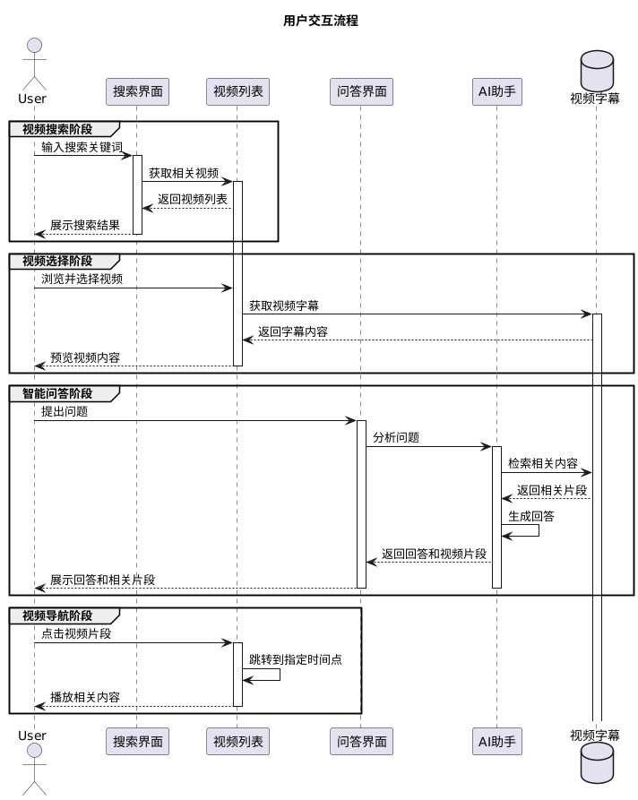

# 当 AI 遇上 YouTube：一次有趣的视频内容分析尝试 🎥

项目地址：[https://github.com/meicanhong/video-search](https://github.com/meicanhong/video-search)


嘿，各位好！你是否也曾经历过这样的痛点：看了一个3小时的视频教程，结果忘记了重点在哪里？或者想在一堆长视频中找到那个关键的"啊哈时刻"？作为一个经常在 YouTube 上学习的开发者，我深有体会。所以，我决定做点什么 —— 让 AI 来帮我们解决这个问题！

## 为什么要做这个项目？🤔

说实话，这个想法来源于我的个人困扰：
1. 视频太长，重点太散 —— 谁还没有被3小时视频教程折磨过呢？
2. 想快速复习，但找不到关键片段 —— 啊，那个重要的知识点到底在哪一分钟来着？
3. 有问题想问，但翻来翻去找不到答案 —— 我记得视频里讲过这个的！

于是，我想：要是能让 GPT-4 帮我们"看"视频，岂不是很酷？

## 核心功能：它是怎么运作的？🔍

简单来说，就是三步走：

### 1. 找视频 🔍
- 你告诉我你想学什么
- 我帮你找到相关视频
- 把视频信息存起来，方便你随时查看

### 2. 读字幕 📝
- 下载视频字幕（优先选择人工字幕）
- 整理格式，建立索引
- 准备好供 AI 分析

### 3. AI 解答 🤖
- 理解你的问题
- 分析字幕内容，找到相关片段
- 给你一个通俗易懂的回答，外加视频时间戳

就是这么简单！接下来我们来看看具体是怎么实现的...



## 工程上的一些小心思 🛠

1. **并发处理**
   - 字幕同时下载（省得等太久）
   - 视频信息一起获取（效率高）
   - API 请求并行处理（快快快）

2. **加个缓存**
   - 字幕存一下（下次就不用重新下了）
   - 视频信息也存一下（反正不会变）
   - API 结果缓存一会（省点钱）

## 想自己玩玩？超简单！🚀

### 1. 准备工作
- 克隆项目：`git clone https://github.com/danny-avila/video-search.git`
- Docker（装好就行，其他啥都不用装！）
- 一个 OpenAI API key（GPT-4 最好）
- 一个 YouTube API key（Google Cloud 上搞一个）

### 2. 配置环境变量
```bash
# 复制环境变量文件
cp .env.example .env

# 编辑 .env 文件，主要填这两个：
OPENAI_API_KEY=你的_OpenAI_API_Key
YOUTUBE_API_KEY=你的_YouTube_API_Key
```

### 3. 启动项目
```bash
# 一行命令搞定
docker-compose --env-file .env up
```

搞定！等镜像构建完成后，打开浏览器访问 `http://localhost:3000` 就能开始玩了！

要是想看看运行日志，可以用：
```bash
docker compose logs -f
```

想停止的时候：
```bash
docker compose down
```

就是这么简单！不用管 Python、Node.js 版本，也不用装一堆依赖，Docker 帮我们搞定一切！

## 写在最后 ✨

说实话，这个项目最有意思的地方是 —— 我没写过一行代码！😎

是的，你没看错。整个项目都是在 Cursor AI 的帮助下完成的。AI 不仅帮我们看视频，还帮我写代码，这操作够骚吧？

目前这个小工具已经完美解决了我的问题：
- 再也不用费劲找视频重点了
- 基于视频内容快速问答，AI 秒懂我的疑惑
- 学习效率蹭蹭往上涨

未来可能会加上 bilibili 作为视频源。

后续有什么新想法，再继续让 AI 帮我加功能。这年头，不用 AI 写代码，感觉都不好意思说自己是程序员了！😆
 