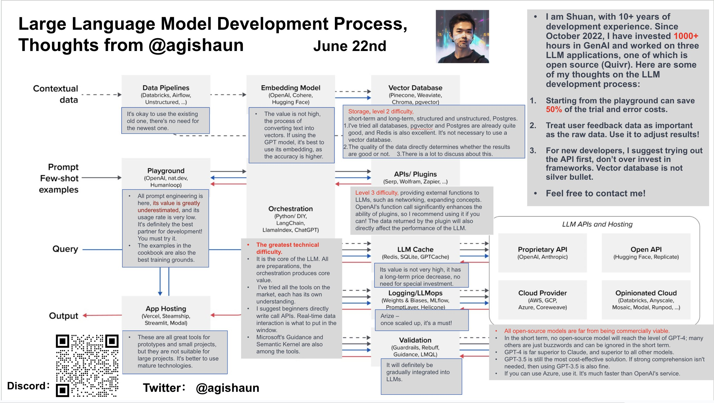
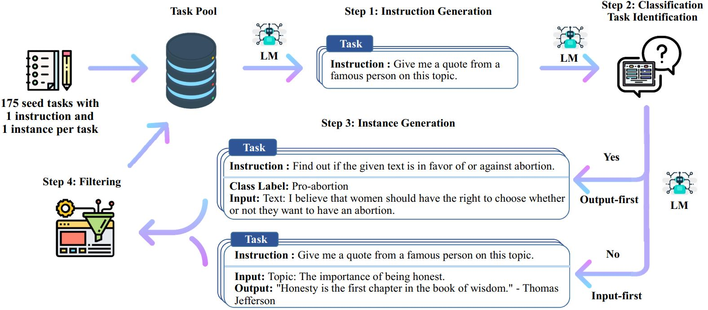

最近在尝试做一个 crypto 领域的 AI 机器人，想要做到我们问一些 crypto 相关的问题，bot 能够进行回答。例如输入 contract address 信息，bot 能够回答这 contract info、contract belong protocol info 等等信息。

为什么不用 ChatGPT 呢？

因为 GPT 只有截止到 2021 年前的数据，没有最新的数据内容。而且 GPT 所知道的信息太泛了，没有专注于 crypto 领域，回答内容时不够专注。

所以，我们需要提供 更多 crypto 领域的知识给 GPT。

那么，如何将知识喂给GPT呢？有不同的层级：

- Prompt 层级。将知识作为上下文信息喂给 GPT
- Fine Tune。将知识作为训练集去训练 LLM，这个方案需要自训练 LLM 模型。

## Prompt Engineer

[https://github.com/hwchase17/langchain](https://github.com/hwchase17/langchain)

要构建属于自己的 AI 应用肯定是逃不过 Langchain 框架的，Langchain 框架帮我们封装好整个AI应用体系需要用到的组件。

构建私有知识库 AI 机器人步骤：

1. 准备数据
2. 将数据切分 并 embeddings，持久化到 vector db
3. 用户提问后，将问题放入 vector db 搜索，得到相似数据
4. 将 vector db 的结果 放入 prompt 中，丢给 LLM 提问
5. LLM 回答问题

这些步骤内，最重要的是准备数据，这部分数据可能来自于：

- 数据库中的结构化数据
- Google Search result
- news、paper、blog 等非结构化数据
- …

私有 AI Chat 服务：

- https://github.com/langgenius/dify
- https://github.com/Chainlit/chainlit

## 自训练 LLM

有几个比较成功的自训练 LLM 模型，我们可以参考其训练过程：

- https://github.com/tatsu-lab/stanford_alpaca
- https://github.com/tloen/alpaca-lora
- https://github.com/AI4Finance-Foundation/FinGPT
- https://github.com/chaoyi-wu/PMC-LLaMA
- https://github.com/nomic-ai/gpt4all

简单介绍以上模型：

- Stanford-Alpaca 提供完整的训练流程和代码，很有参考意义。
- Alpace-Lora 是利用 Lora 技术，使整个模型训练 更快更轻，对硬件要求没那么高。
- FinGPT 是一个实际的自训练模型落地应用，是金融领域的LLM
- PMC是 喂了 4.3M 医学论文进行微调的 基于 LLaMA 模型 的 医学 LLM

### Self-Intruct

训练模型需要准备数据，https://github.com/yizhongw/self-instruct 提供了一种可以生成大量训练数据的方法。

生成过程：

1. 人工设计了175个表示不同任务的指令，并且给每条数据都编写了（指令, 输入, 输出）/（指令, 输出），将这175条数据作为种子池。
2. 使用模型生成新的指令；
3. 对该模型生成的指令判断是否分类任务；
4. 使用模型生成实例；
5. 对上述模型生成的数据进行过滤和后处理；
6. 将经过过滤和后处理的数据添加到种子池中；
7. 一直重复上述2到6步直到种子池有足够多的数据；

具体流程：

1. 从种子集开始，抽几条出来让 GPT 模仿，生成一条 `instruction`
2. 判断这条 `instruction` 是否能分类，然后继续让 GPT 生成 `instance`（即输入输出）
    1. 输入优先：`is_classification`：false
    2. 输出优先：`is_classification`：true。因为对于分类任务，如果先生成文本，后生成标签，模型会偏向于生成比较单一的结果。
3. 验证步骤2生成的指令质量，质量高的才留下，放到种子集中，然后进行下一次循环。

